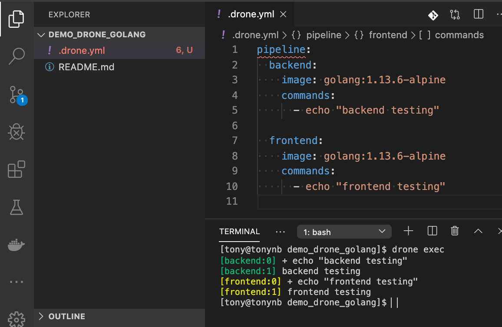

# DevOps

- 2020/01/23

## Ngrok

```bash
$# ngrok http -host-header=rewrite <DOMAIN HEADER>:<PORT>
ngrok http -host-header=rewrite mydrone.com:8081
```

## GitLab

> User Setting > Applications > Redirect URI 填入 `https://DRONE_HOST/authorize`
  DRONE_HOST 可使用 ngrok 來做本地測試, 我使用 `ngrok http -host-header mydrone.com 17777`

Scopes 選擇 `api` && `read_user`, 取得底下:

- Application ID: 14dc7b022c890e5dd603981b9f8c1e6e78485fd79c5c0cea80112b04c61a48cc
- Secret: 4080059c8902246284f0fc36e6b432154f84f527697c13869b03ad0fa4b012ea

填入 `.docker-compose.yml` 對應的 GitLab 環境變數對應的 CLIENT && SECRET

## Drone

### Install drone CLI

- https://docs.drone.io/cli/install/

```bash
### Macbook
curl -L https://github.com/drone/drone-cli/releases/latest/download/drone_darwin_amd64.tar.gz | tar zx
sudo cp drone /usr/local/bin
```

在存有 `.drone.yml` 的地方使用 `drone exec`, 就算沒有 drone server, 依舊可以執行測試



### Install drone by compose (Server && Agent)


Drone 基於 Container 的 CI/CD 系統(所有流程都在 Docker Container). Git push 後, 驅動 Drone 開始執行 (都在 Docker 內)

- Git Clone
- Test
- Package
- Deploy
- Send Message

使用 `.drone.yml` 做組態控制

---

drone 0.8 版以後, 拆成: `drone-server` && `drone-agent`


```yml
version: '2'

services:
  drone-server:  # drone agent 參考這裡
    image: drone/drone
    ports:
      - 28080:8000  # Drone Server web 介面
      - 29000:9000  # Server && Agent 溝通
    volumes:
      - ./:/var/lib/drone/  # 預設使用 sqlite, DB 位置就在這
    restart: always
    environment:
      - DRONE_HOST=http://mydrone.com  # 跑 Drone 的 public domain
      - DRONE_OPEN=true  # 後台是否開放 Drone 註冊
      - DRONE_SECRET=@@abc__xyz%%  # server 與 agnet 溝通的 key (需相同)
      - DRONE_ADMIN=tony  # 可用 "," 區隔, ex: admin,tony
      # GitLab Config
      - DRONE_GITLAB=true
      - DRONE_GITLAB_CLIENT=${CLIENT}
      - DRONE_GITLAB_SECRET=${SECRET}
      - DRONE_GITLAB_URL=http://mygitlab.com
    drone-agent:  # 完全依靠 docker container 來做事情
      image: drone/agent
      restart: always
      depends_on:
        - drone-server
      volumes:
        - /var/run/docker.sock:/var/run/docker.sock
      environment:
        - DRONE_SERVER=drone-server:9000  # 根據 drone/server 的 service name:PORT 來命名
        - DRONE_SECRET=@@abc__xyz%%
        - DRONE_MAX_PROCS=3  # agent 可同時 build 幾個 commit or project
```
