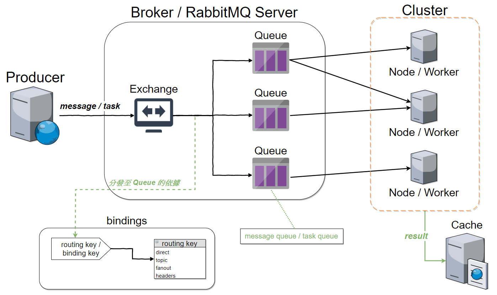

# RabbitMQ

- 2019/07/05
- [Rabbit MQ 官網](https://www.rabbitmq.com/)
- [AMQP, RabbitMQ and Celery - A Visual Guide For Dummies](https://www.abhishek-tiwari.com/amqp-rabbitmq-and-celery-a-visual-guide-for-dummies/)



# 安裝

使用 Docker 來做示範:

```bash
###
$# docker run -d \
    -p 5672:5672 \
    -p 15672:15672 \
    -e RABBITMQ_NODENAME=mq1 \
    --name=mq \
    --hostname=tonyhost \
    rabbitmq:management
c7fdf1313520c9b30c68cb826122afe2397a0a1c6c8e22da6e0831ea6f092de4
# 然後就可以開始玩了
```

## 實作

程式端 與 `RabbitMQ` 溝通, 使用 `AMQP` 傳輸協定, 所以需要支援 AMQP Library

Python 可用下列套件來實作
    - py-amqplib
    - txAMQP
    - Pika
