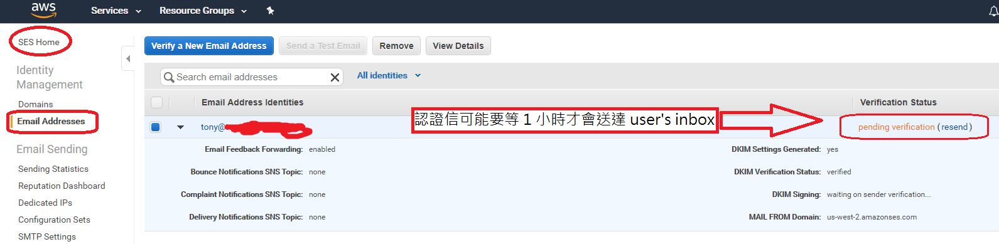

# Amazon Simple Email Service (Amazon SES)

- 2019/01/08
- [設定接收電子郵件的管道](https://aws.amazon.com/tw/getting-started/projects/setup-email-receiving-pipeline/)

因為我已經買了 `Route 53`, 所以就傻傻的讓他幫我認證我的網域...


## terms

- DKIM, DomainKeys Identified Mail : 讓寄件者為信件作加密.

- KMS, Key Management Service


## S3

- 要讓 `Amazon SES` 寫信, 並且存放到 `S3 bucket`, 需使用 `AWS KMS key` 來為信件作加密.


### Email Addresses

```
You have successfully sent a verification email to tony@tonychoucc.com. It may take up to an hour for the verification email to arrive in this user's inbox. The address has been added to the list of Verified Identities with a status of "pending verification" and will be marked as "verified" when the user opens the email message and completes the verification process. Any previous verification emails for tony@tonychoucc.com are no longer valid.
```

