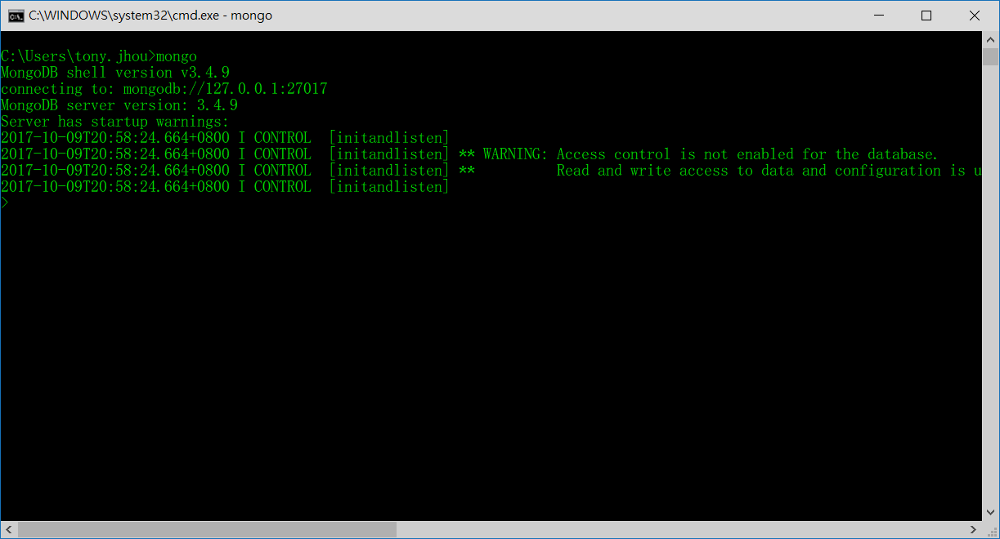

# Windows 10 使用 MongoDB v3.4 (含服務)

- 2017/10/09, 2018/08/24 更新
- 以 `3.4.9版 2008R2Plus SSL (64bit)` 為例

分為 `兩種使用方式`, `A:安裝` or `B:純使用`, 但都得先下載 MongoDB...


# 下載 MongoDB

- [MongoDB官方網站](https://www.mongodb.com/download-center#community)

版本選擇: Version: Windows Server 2008 R2 64-bit and later, with SSL support x64


# A:安裝

## 1. 安裝

完整安裝 ,一口氣下一步到底, 採用預設路徑安裝的話, 沒意外會裝在 `C:\Program Files\MongoDB\Server\3.4`, 前往 `控制台 > 新增移除程式` 看看是否安裝成功!! 但我稱這個叫做`假安裝`, 因為安裝後, 依然沒辦法使用@@!!


## 2. 設定環境變數

設定 MongoDB 的 環境變數


## 3. 安裝 MongoDB 服務

1. 建立 相關資料夾 && 組態檔案

    D:\MongoDB\data\db\
    D:\MongoDB\log\
    D:\MongoDB\mongod.cfg


`mongod.cfg`, 內容如下:

```cfg
dbpath=D:\MongoDB\data\db
logpath=D:\MongoDB\log\mongod.log
```

2. 安裝 MongoDB 服務

以 `系統管理員` 身分打開 `命令提示字元(Command Line)`

```cmd
> d:
> cd MongoDB
> mongod --config "D:\MongoDB\mongod.cfg" --install
> net start MongoDB
```

若打字打錯還怎樣的導致安裝失敗, 得先刪除 `安裝失敗的遺跡`, 再重新安裝

```cmd
> mongod --config D:\MongoDB\mongod.cfg --remove
> mongod --config D:\MongoDB\mongod.cfg --install
```


# B:純使用

Terminal A - 建立 Mongo Server

```cmd
::# (自定義的資料夾，該資料夾會記錄DB的訊息)
> mongod --dbpath d:\mongodb\data\db
```

Terminal B - Mongo Client 連線

```cmd
> mongo
```


# 安裝後檢查是否安裝成功

```cmd
> mongo --version
MongoDB shell version v3.4.9
git version: 876ebee8c7dd0e2d992f36a848ff4dc50ee6603e
OpenSSL version: OpenSSL 1.0.1u-fips  22 Sep 2016
allocator: tcmalloc
modules: none
build environment:
    distmod: 2008plus-ssl
    distarch: x86_64
    target_arch: x86_64
```

MongoDB 進入畫面


