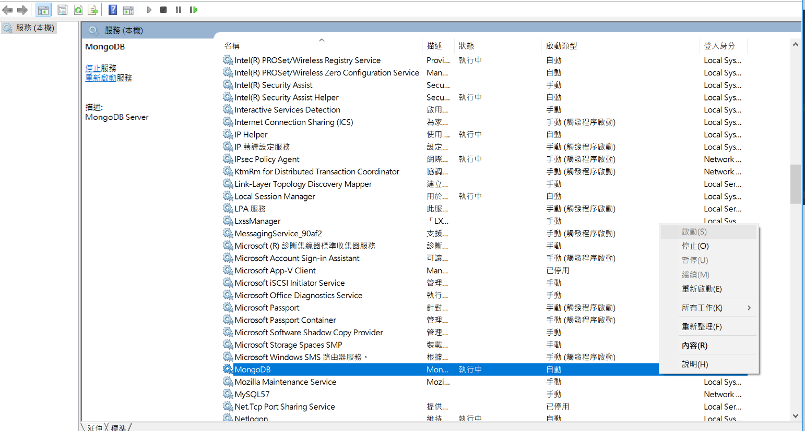

# Win10安裝mongoDB (含服務)
- 2017/10/09
- 以 `3.4.9版 2008R2Plus SSL (64bit)` 為例

## 下載 MongoDB

[MongoDB官方網站](https://www.mongodb.com/download-center#community)

版本選擇:
Version: Windows Server 2008 R2 64-bit and later, with SSL support x64

## 1. 安裝方式
完整安裝 ,一口氣下一步到底, 採用預設路徑安裝的話, 沒意外會裝在
```
C:\Program Files\MongoDB\Server\3.4
```

<font color="red">請到控制台>新增移除程式看看是否安裝成功!!</font>

(稍早原以為安裝完了, 搞了老半天, 發現新增移除程式沒有`MongoDB`...)

## 2. 設定環境變數
這邊有點懶得仔細說明, 

新增環境變數 mongod
```
C:\Program Files\MongoDB\Server\3.4
```

到Path新增
```
%mongod%\bin
```

## 3. 安裝MongoDB服務
1. 建立相關資料夾
2. 建立組態
3. cmd 依照組態安裝服務
4. 使用 MongoDB

---

1. 建立相關資料夾及檔案

```
D:\mongoDB\data
D:\mongoDB\log
D:\mongoDB\mongod.cfg
```

2. 建立組態

    D:\mongoDB\mongo.cfg

    內容如下
```
dbpath=D:\mongoDB\data
logpath=D:\mongoDB\log\mongod.log
```

3. cmd 依照組態安裝服務
```cmd
d:
cd mongoDB
mongod --config "D:\mongoDB\mongod.cfg" --install
```

以上即完成安裝, 下列步驟確認是否安裝成功

win+R, 輸入 「services.msc」

找看看有沒有 `MongoDB`, 如下圖



右鍵 > 啟動

4. 使用 MongoDB

進入 cmd
```cmd
mongo
```
即可進入mongoDB
