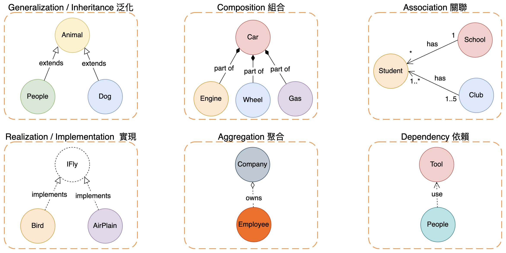

# UML

UML 定義了非常多的 圖, 而底下寫的都是以 類別圖 為主.

UML 定義了 6 種 "關係", 如下:


強弱順序: Generalization = Realization > Composition > Aggregation > Association > Dependency

### Generalization(泛化)
- 繼承關係, 子類別特化父類別的特徵和行為

### Realization(實現)
- 類別實作介面的關係

### Composition(組合)
- 整體 與 部件 的生命週期 一致

### Aggregation(聚合)
- 整體 與 部件 的生命週期 各自獨立
- (單獨/完全)擁有的關係. (Own)
  - ex: Car and Driver
  - ex: 拼圖

### Association(關聯)
- ClassA 知道/使用 ClassB 的 屬性/方法.
- (可共同)擁有的關係. (Has)
  - ex: Car and Wheels `Car 持有對 Wheels 的參考`
- 關係可以是 雙向 也可以是 單向
  - ex: 讀者 && 書 && 作者 之間的關係

### Dependency(依賴)
- 使用的關係. 一個類別的實現, 需要另一個類別的協助
- 盡量不要讓他們變成雙向的關係!!


# 範例

## 1. Composition vs Aggregation vs Association

```py
### Composition: Earth 負責維護 People, Earth 死, People 跟著死
class Earth:
    __people: List[People] = []

### Aggregation: People drive a borrowed Book
class People:
    car = None
    def __init__(self, car: Car):
        self.car = car

### Association: People use Tool
class People:
    def use(tool: Tool): pass
```

## 2. Composition vs Aggregation

University 有(owns)許多 Departments, 而每個 Department 有(has) 一堆 Professors

University 消失以後, Departments 也跟著消失, 但是 Professors 依舊存活.

因此, University can be seen as a composition of Departments, Departments have an aggregation of Professors