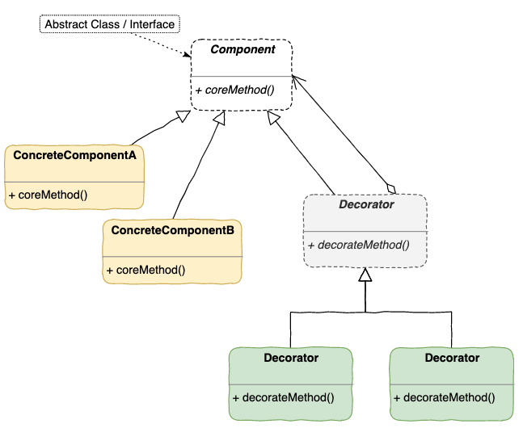

# Decorator Pattern

> The decorator pattern attaches additional responsibilities to an object dynamically. Decorators provide a flexible alternativity to subclassing for extending functionality.

- Component 定義物件介面, 將來 Component(黃 & 綠) 可以被動態的添加職責
- Decorator 繼承 Component 只是為了達到 **形態相同**

## 摘要
- 可在 runtime 期間增加額外功能
- 可以有效地把 **核心職責** 與 **附加功能** 分開
- 裝飾的順序會攸關功能的實踐!!
