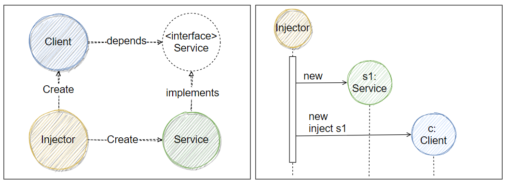

# Dependency Injection, DI
- [wikipedia-Dependency injection](https://en.wikipedia.org/wiki/Dependency_injection)

## 摘要

- 軟體工程裏頭, **DI** 就是指: objectA 收到他所依賴的 objectB
  - objectA 所依賴的東西可以有很多個
- 我們稱 接收到依賴的那一方(objectA) 為 `client`, 被交付(被注入)的那一方(objectB) 為 `service`
- 實作將 service 交付給 client 的程式碼, 我們稱之為 `injector`
- 將 objectB 交付給 objectA 的過程, 稱之為 `injection`
- DI 的精神之一, 並非是讓 client 聲明他所需要什麼, 取而代之的是, 讓 injector 告訴 client 你要用哪個 service
- DI 的精神之一, 讓物件的建構及使用過程達成 *separation of concerns, SoC*
  - Soc, ex: 將 js 嵌入到 html 裏頭, html 只管好網頁看起來的骨幹, js 只管好他要怎麼動起來, 讓兩邊程式上的設計不互相干擾, 增加可讀性 && 程式碼覆用性
- DI 其實是一種 *inversion of control, IoC*
  - Ioc ex: 
- client 不須知道 injector 的存在, 也不需要理會 service 如何建構, 它只知道 service interface. 將 use 與 construct 的職責分離開來

