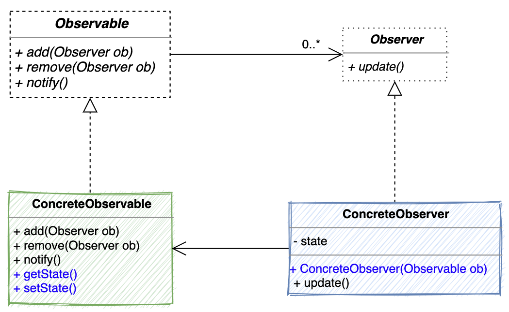

# Observer Pattern

> The **observer pattern** define a one-to-many dependency between objects so that when one object has change state, all of its dependencies are notified automatically.

## 概念摘要

- 使用時機: 當一個物件的改變需要同時改變其他物件時(而且不知道有多少個物件需要連同被改變)
- 觀察者模式 or 監聽模式 or 發布/訂閱模式
- 核心精神: 在 觀察者 與 被觀察者 之間, 建立自動觸發的機制
- 監聽的物件: Observer
- 被監聽的物件: Observable / Subject

TODO: 推模型 vs 拉模型
