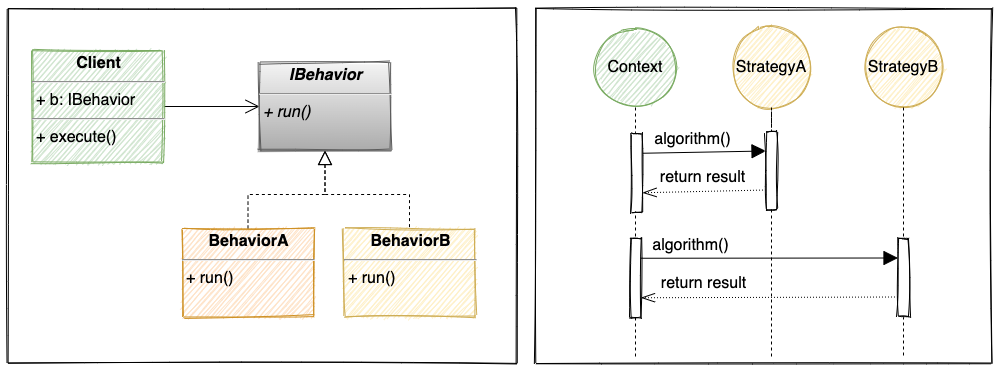

# Strategy Pattern

> The **strategy pattern(policy pattern)** defines a family of algorithms, encapsulates each one, and makes them interchangeable. Strategy lets the algorithm vary independently from clients that use it.

## 概念摘要

- 分離了 `策略使用者` && `策略`
- Composition should often be favored over inheritance.
- 相較於簡單工廠模式(直接回傳類別實例), 它直接在方法內部去實作策略實例的建構, 並且執行實際策略的方法
- 如果接收到的需求像是, 這東西要能完成 OO 功能, 但是 OO 還不是很明確, 而且將來可把 OO 替換成 XX, YY, ... 等等的功能. 若這樣就可考慮 策略模式.
- 經典的範例: 排序
    - 驗證: 18歲以上才可以幹嘛幹嘛, 18歲以上且持有護照才可幹嘛幹嘛, ...
    - 產出: 依照輸入, 處理完後輸出 csv, pdf, txt, ...
    - 儲存: 存到 DB, 存成檔案, 作 API Request, ...
    - 角色動作: 從 A 到 B, 要用走的, 用跑的, 用游的, 將來也可能有瞬間移動的需求也說不定
- 若將來有新的實體策略的需求時, 只需要增加策略類別 & 改寫 Context
