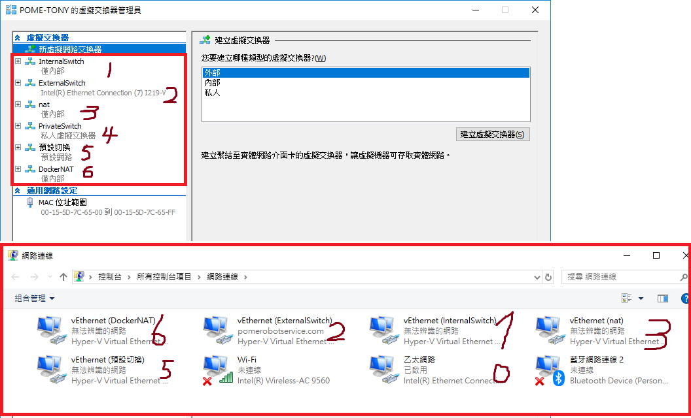

# Docker 自學筆記

- [Docker 網路架構](https://github.com/docker/libnetwork/blob/master/docs/design.md)
- [Docker daemon.json - 寫得還不錯](https://blog.csdn.net/u013948858/article/details/79974796)

```bash
### 2020/04/06 的今天, 目前為 19.03 版, 底下可看離線教學文件
$# docker run --rm -p 4000:4000 --name doc docs/docker.github.io:latest
```


> Docker 使用 `storage drivers` 來管理 `image layers` 及 `writable container layer` 的內容. 然而各種 `drivers` 實作方式不同, 但都使用 `stackable image layers` 及 `copy-on-write(CoW)策略`.


# 1. Docker Command

## 指令

```sh
$ docker run -d --name nginx nginx

# 查看 Container 內的 IP Address(查Container的IP)
$ docker inspect --format '{{ .NetworkSettings.IPAddress }}' nginx
172.17.0.2

# 用 Image: busybox 建立 Container: foo, 指定他的 host為 foobar, 並執行 "sleep 300"的指令
$ docker run -d --name foo -h foobar busybox sleep 300

# 查看 運行中的 Container: foo, 並查看他的 foobar這個 host的 相關資訊
$ docker exec -it foo cat /etc/hosts | grep foobar
172.17.0.2	foobar

# 依照本地的 dockerfile建立名為 flask 的 image
$ docker build -t flask .

# 查看 foobar Container的 5000 port資訊
$ docker port foobar 5000
0.0.0.0:32768

# 建立並執行 Container: nginx, 並且查看本機端的 iptables
$ docker run -d -p 5000/tcp -p 53/udp --name nginx nginx
$ sudo iptables -L
...(一堆)...
Chain DOCKER (2 references)
target    prot opt source      destination
ACCEPT    tcp  --  anywhere    172.17.0.2     tcp dpt:commplex-main
ACCEPT    udp  --  anywhere    172.17.0.2     udp dpt:domain
...(一堆)...
```

```sh
# Container 複製到 Host
$ docker cp testcopy:/root/file.txt .

# Host 複製到 Container
$ docker cp host.txt testcopy:/root/host.txt
```

```sh
# 追 Container 異動紀錄
$ docker diff <Container>
# A: 增
# C: 改
# D: 刪
```


# 分享 Containers

- 使用 `save` and `load`, image <-> tarball
- 使用 `import` and `export`, container <-> tarball

```sh
### import && export
$ docker ps -a
CONTAINER ID    IMAGE           COMMAND                  CREATED        STATUS              PORTS      NAMES
9eac4abf6565    redis:3.2.12    "docker-entrypoint.s…"   11 days ago    Exited 1 days ago   6379/tcp   redis
# ↑ 9eac

# 使用 docker export 匯出成 tarball
$ docker export 9eac > aa.tar

# tarball 還原 Image
$ docker import - aaimage < aa.tar
sha256:c1d29501022185ede31996c72336e71f57fcbb4b9e4c964f0bb6c332eb0612be

$ docker images
REPOSITORY     TAG       IMAGE ID        CREATED          SIZE
aaimage        latest    c1d295010221    6 minutes ago    73.4MB
redis          3.2.12    2fef532eadb3    5 weeks ago      76MB


### save && load
$ docker images
REPOSITORY    TAG      IMAGE ID        CREATED         SIZE
redis         3.2.12   2fef532eadb3    5 weeks ago     76MB
# Image ID: 2fef

$ docker save -o aa.tar 2fef
$ ls
aa.tar

$ docker rmi 2fef
$ docker images
REPOSITORY    TAG      IMAGE ID        CREATED         SIZE

$ docker load < aa.tar
$ docker images


```


```sh
# 溫和移除
$ docker stop ...

# 暴力移除
$ docker kill ...
```


## 操作 Container
```sh
# 啟動睡著的 Container
$ docker start <ContainerName>

# 進入 Container(running container)
$ docker attach <ContainerName>

# 快速離開 Container (但不結束)
# <Ctrl+p> + <Ctrl+q>
```


> `docker run -d --name <Container Name> -h <Host Name> <Image Name> <其他指令>` 使用 Image建立 Container, 並指定 hostname, 然後執行相關指令


### MySQL 與 WordPress

```sh
$ docker pull wordpress:latest
$ docker pull mysql:latest

$ docker run --name mysqlwp -e MYSQL_ROOT_PASSWORD=wordpressdocker -d mysql

# 老舊版本的 Networking 方式
$ docker run --name wordpress --link mysqlwp:mysql -p 80:80 -d wordpress

# Bind Mound方式, 將本地的 /home/docker/mysql Bind Mound 到 Container 內的 /var/lib/mysql
$ docker run --name mysqlwp -e MYSQL_ROOT_PASSWORD=wordpressdocker \
                            -e MYSQL_DATABASE=wordpress \
                            -e MYSQL_USER=wordpress \
                            -e MYSQL_PASSWORD=wordpresspwd \
                            -v /home/docker/mysql:/var/lib/mysql \
                            -d mysql

# Docker 備份 mysql container
$ docker exec mysqlwp mysqldump --all-databases \
                                --password=wordpressdocker > wordpress.backup
```


## [dockerd 組態](https://docs.docker.com/engine/reference/commandline/dockerd/)
- 2018/06/19

os      | default config file path
------- | -----------
Windows | %programdata%\docker\config\daemon.json
Linux   | /etc/docker/daemon.json


- 每個運行在 service內的單一 container, 都稱為 **task**, 且每個 task都有專屬的 **task id**

```

6. 查看 load-balance的威力~~~, 每次進入的 container都不同!!
- 如果反應時間太久(可能達數十秒), 並不表示 container效能問題, 而是未能滿足 REDIS的依賴關係(後面會談到)
- 底下出現的 `counter disabled`, 是因為服務內, 還沒有儲存數據的機制
- Linux terminal, 要用 `curl -4`, 原理不懂... 單純 `curl` 抓不到orz
```sh
$ curl -4 http://localhost
<h3>Hello World!</h3><b>Hostname:</b> e7d33737b65f<br/><b>Visits:</b> <i>cannot connect to Redis, counter disabled</i>
$ curl -4 http://localhost
<h3>Hello World!</h3><b>Hostname:</b> 1e61d9e996b0<br/><b>Visits:</b> <i>cannot connect to Redis, counter disabled</i>
$ curl -4 http://localhost
<h3>Hello World!</h3><b>Hostname:</b> f93397cceb7b<br/><b>Visits:</b> <i>cannot connect to Redis, counter disabled</i>
$ curl -4 http://localhost
<h3>Hello World!</h3><b>Hostname:</b> dc42c0ebc7af<br/><b>Visits:</b> <i>cannot connect to Redis, counter disabled</i>
$ curl -4 http://localhost
<h3>Hello World!</h3><b>Hostname:</b> e0008228c4f9<br/><b>Visits:</b> <i>cannot connect to Redis, counter disabled</i>
```

7. 調整 scale
- 去修改前面建立的 `docker-compose.yml`
- 重新執行 `docker stack deploy -c docker-compose.yml getstartedlab` 即可, 不需要手動刪除或重起任何 container
- 可以在運行期間, 修改 `docker-compose.yml`, 並且重新執行 `docker stack deploy`的指令, 變可在生產途中作 scale outdock.


8. 關閉服務  && 關閉 swarm
> 關閉 app語法: `docker stack rm <app名稱>`
```sh
$ docker stack rm getstartedlab
Removing service getstartedlab_web
Removing network getstartedlab_webnet
```
> 關閉 swarm
```sh
$ docker swarm leave --force
Node left the swarm.
```


# 2. Dockerfile
- [官方教學](https://docs.docker.com/engine/reference/builder/#usage)

 起手式 | 範例 | 說明 |
 --- | --- | --- |
 ADD | ADD . /app | 把本地目前資料夾底下的東西, 複製到指定 container的 /app內 |
 CMD | CMD ["python", "app.py"] | container啟動後, 執行 app.py
 COPY |  |
 ENTRYPOINT |  |
 ENV | ENV NAME World <br />ENV https_proxy host:port | 設定環境變數 NAME 為 World <br /> 可以設定 Proxy Server
 EXPOSE | EXPOSE 80 | 開放 80 port
 FROM |  |
 MAINTAINER |  |
 ONBUILD |  |
 RUN |  | 執行腳本
 USER |  |
 VOLUME |  |
 WORKDIR | 進入Container後的起始路徑<br /> 對於`RUN`, `CMD`, `ENTRYPOINT`, `COPY`, `ADD`皆有效 <br /> 可以設定絕對/相對路徑 |


> `docker run 的參數` 可覆寫 DOCKERFILE的 `CMD`

> `docker run --entrypoint XXX` 可覆寫DOCKERFILE的 `ENTRYPOINT`


---
---
---


# 3. Dockerfile Examples

#### 範例 - Flask起 Server
- [官方範例](https://docs.docker.com/get-started/part2/#dockerfile)
- 2017/12/07

> 先建立 3個檔案, 再建立 Image

1. dockerfile
```dockerfile
FROM python:2.7-slim
WORKDIR /app
ADD . /app
RUN pip install --trusted-host pypi.python.org -r requirements.txt
EXPOSE 80
ENV NAME World
CMD ["python", "app.py"]
```

2. requirement.txt
```
Flask
Redis
```

3. app.py
```py
from flask import Flask
from redis import Redis, RedisError
import os
import socket

# Connect to Redis
redis = Redis(host="redis", db=0, socket_connect_timeout=2, socket_timeout=2)

app = Flask(__name__)

@app.route("/")
def hello():
    try:
        visits = redis.incr("counter")
    except RedisError:
        visits = "<i>cannot connect to Redis, counter disabled</i>"

    html = "<h3>Hello {name}!</h3>" \
           "<b>Hostname:</b> {hostname}<br/>" \
           "<b>Visits:</b> {visits}"
    return html.format(name=os.getenv("NAME", "world"), hostname=socket.gethostname(), visits=visits)

if __name__ == "__main__":
    app.run(host='0.0.0.0', port=80)
```

4. run
```sh
$ ls
app.py  requirements.txt  dockerfile

$ docker build .

$ docker images
REPOSITORY    TAG         IMAGE ID        CREATED           SIZE
<none>        <none>      c8d0def6863d    28 seconds ago    148MB
python        2.7-slim    4fd30fc83117    7 weeks ago       138MB
# 因為並沒有指定建立的 Image的名稱..., 所以只有 Image ID

$ docker run -p 4000:80 c8d0
```


#### 範例 - ENTRYPOINT
- 2018/01/30

> ENTRYPOINT 建立 Image 時不執行; 啟動 Container 時才執行

1. dockerfile
```dockerfile
FROM ubuntu:14.04
ENTRYPOINT ["/bin/echo"]

# 或者
# FROM ubuntu:14.04
# CMD ["/bin/echo" , "Hi Docker !"]
```
2. run
```sh
$ docker build .

$ docker images
REPOSITORY     TAG       IMAGE ID        CREATED          SIZE
<none>         <none>    ac41d98ae2f5    3 minutes ago    222MB
ubuntu         14.04     dc4491992653    4 days ago       222MB

$ docker run ac41 HIII~~
HIII~~

$ docker ps -a
CONTAINER ID    IMAGE    COMMAND               CREATED    STATUS    PORTS    NAMES
d13e1f5a3f72    ac41     "/bin/echo HIII~~"    ...        ...                stoic_johnson
# 每次 RUN Image, 都會啟動新的 Container, 然後再關掉
```

#### 範例 - CMD
- 2018/01/30

1. dockerfile
```dockerfile
FROM ubuntu:14.04
CMD ["/bin/echo" , "Hi Docker !"]
```

2. run
```sh
$  docker build .

$ docker images
REPOSITORY    TAG       IMAGE ID        CREATED           SIZE
<none>        <none>    2d0610d94311    17 seconds ago    222MB
ubuntu        14.04     dc4491992653    4 days ago        222MB

$ docker run 2d06 /bin/date
Tue Jan 30 07:06:40 UTC 2018

$ docker container ls -a
CONTAINER ID    IMAGE    COMMAND        CREATED          STATUS    PORTS    NAMES
00f8e0ace3e5    2d06     "/bin/date"    7 seconds ago    ...                distracted_brattain
```


#### 範例 -
- 2018/01/30

1. dockerfile
```dockerfile
FROM ubuntu:14.04
RUN apt-get update
RUN apt-get install -y python
RUN apt-get install -y python-pip
RUN apt-get clean all
RUN pip install flask

ADD hello.py /tmp/hello.py
EXPOSE 6000
cmd ["python", "/tmp/hello.py"]
```

2. hello.py
```py
from flask import Flask
app = Flask(__name__)
@app.route('/hi')
def hello_world():
  return 'Hello World!'
if __name__ == '__main__':
  app.run(host='0.0.0.0', port=6000)
```

3. run
```sh
$ ls
dockerfile  hello.py

$ docker build -t flask .
# 使用本地 dockerfile 建立 tag為 flask的 docker image

$ docker images
REPOSITORY     TAG         IMAGE ID        CREATED           SIZE
flask          latest      ac9445327790    39 seconds ago    397MB
flask_image    latest      76ab99223787    24 hours ago      707MB
python         2.7-slim    4fd30fc83117    7 weeks ago       138MB

$ docker run -d -P flask
27829ed44e8a82e465380368d6241356669ced08d9563e11a3195af84c482818

$ docker ps
CONTAINER ID    IMAGE    COMMAND                  CREATED    STATUS    PORTS                     NAMES
27829ed44e8a    flask    "python /tmp/hello.py"   ...        ...       0.0.0.0:32768->6000/tcp   epic_ptolemy
# 可透過 localhost:32768/hi 訪問 flask
```


---
---
---

# 4. 備註

> 如果在 `run`和`build` images的時候, 沒有明確指名 `tag`, 則會視為`latest`

```sh
# 建立名為 web的 Container, 並將它 link到 db Container
$ docker run -d -P --name web --link db:db training/webapp python app.py
```


## Volume 使用方式

```sh
# 建立Container後, 獨立建立 Container Volume
$ docker run -it --name os7A -v /data ubuntu14.04 /bin/bash
root@7c49:/$# touch /data/foobar
root@7c49:/$# ls data/
foobar
root@7c49:/$# exit

# 查看 Volume
$ docker inspect -f {{.Mounts}} 7c49
[{volume b8e1ff
/var/lib/docker/volumes/b8e1ff/_data /data local  true }]

# 使用別的 Volume
$ docker run -it --volumes-from os7A --name os7B ubuntu14.04 /bin/bash
root@895f:/$# ls /data
foobar
```


## 查看資訊
```sh
# 查看 Docker Volume
$ docker inspect -f {{.Mounts}} <Container>

# 查看 Docker Network
$ docker network inspect <Network>
```


### boot2docker

```sh
# 使用 Docker Machine 後, 裏頭的 Docker
$ boot2docker init

# 升級 Docker Machine 內的 Docker version
$ boot2docker stop
$ boot2docker upgrade
$ boot2docker start
```


# 5. 知識

## 定義Docker容器如何在生產中運行的文件: yml
docker-compose.yml 範例
```yml
version: "3"
services:
  web:
    # replace username/repo:tag with your name and image details
    image: username/repo:tag
    deploy:
      replicas: 5
      resources:
        limits:
          cpus: "0.1"
          memory: 50M
      restart_policy:
        condition: on-failure
    ports:
      - "80:80"
    networks:
      - webnet
networks:
  webnet:
```


## docker cp
- [Copying files from Docker container to host](https://stackoverflow.com/questions/22049212/copying-files-from-docker-container-to-host#)

> 複製 Container 內的檔案到 Host, 語法: `docker cp <Container ID>:<path> <host path>`

```sh
# 把 463d2b6f28cf 這個 Container 裡的 /root/.ssh 複製出來到 Host 的 目前位置
$ docker cp 463d2b6f28cf:/root/.ssh/ .
```


## 名詞

> yml: 用來表達資料序列的格式

> swarm: A swarm is a group of machines that are running Docker and joined into a cluster. 每台加入 swarm的機器, 都稱為 nodes.

> hypervisor: 虛擬機器監控裝置


```sh
# 查看 「運行中 Container」的大小, ['size', 'virtual size']
$ docker ps -s
```

# Windows vs Linux Container

- 2018/09/20


```powershell
### Linux Container
> docker network ls
NETWORK ID          NAME                DRIVER              SCOPE
7280e8a0597c        bridge              bridge              local
a26f1acc48e6        host                host                local
5c32253289c9        none                null                local


### Windows Container
> docker network ls
NETWORK ID          NAME                DRIVER              SCOPE
45f5073a72bf        ExternalSwitch      transparent         local
619942edbcff        nat                 nat                 local
b26d7431a85e        none                null                local
3432c65f886b        預設切換             ics                 local
```


MobyLinuxVM 是啟用 Linux Container 之後才出現的, 原本我使用 Windows Container 時, 還看不到它, 但要使用 Linux Images 時, 發現 Windows Container 無法使用, 切換到 Linux Container 之後, 它就出現了!!


```powershell
> ipconfig


### 1 手動新增的 Internal Switch
乙太網路卡 vEthernet (InternalSwitch):

   連線特定 DNS 尾碼 . . . . . . . . :
   連結-本機 IPv6 位址 . . . . . . . : fe80::c941:1ad4:5463:ad66%7
   自動設定 IPv4 位址 . . . . . . . .: 169.254.173.102
   子網路遮罩 . . . . . . . . . . . .: 255.255.0.0
   預設閘道 . . . . . . . . . . . . .:

### 2 手動新增的 External Switch
乙太網路卡 vEthernet (ExternalSwitch):

   連線特定 DNS 尾碼 . . . . . . . . :
   連結-本機 IPv6 位址 . . . . . . . : fe80::80f5:8c6f:43f9:dd4f%21
   IPv4 位址 . . . . . . . . . . . . : 192.168.124.101
   子網路遮罩 . . . . . . . . . . . .: 255.255.255.0
   預設閘道 . . . . . . . . . . . . .: 192.168.124.254

### 3 Windows Container 使用的 NAT
乙太網路卡 vEthernet (nat):

   連線特定 DNS 尾碼 . . . . . . . . :
   連結-本機 IPv6 位址 . . . . . . . : fe80::690f:d8e:dec8:255a%29
   IPv4 位址 . . . . . . . . . . . . : 172.25.144.1
   子網路遮罩 . . . . . . . . . . . .: 255.255.240.0
   預設閘道 . . . . . . . . . . . . .:

### 5 Hyper-V 預設的 NAT
乙太網路卡 vEthernet (預設切換):

   連線特定 DNS 尾碼 . . . . . . . . :
   連結-本機 IPv6 位址 . . . . . . . : fe80::6d63:b9d7:b1eb:229a%18
   IPv4 位址 . . . . . . . . . . . . : 172.22.35.1
   子網路遮罩 . . . . . . . . . . . .: 255.255.255.240
   預設閘道 . . . . . . . . . . . . .:

### 6 Linux Container 使用的 NAT
乙太網路卡 vEthernet (DockerNAT):

   連線特定 DNS 尾碼 . . . . . . . . :
   IPv4 位址 . . . . . . . . . . . . : 10.0.75.1
   子網路遮罩 . . . . . . . . . . . .: 255.255.255.0
   預設閘道 . . . . . . . . . . . . .:
```




### 額外備註

在 `centos:7` 的 docker image內, 編譯 git 時, 因為缺乏許多套件, 發生下列錯誤

```sh
$ make
    * new build flags
    CC credential-store.o
In file included from credential-store.c:1:0:
cache.h:42:18: fatal error: zlib.h: No such file or directory
 #include <zlib.h>
                  ^
compilation terminated.
make: *** [credential-store.o] Error 1
```

解法: [Install Git](https://tecadmin.net/install-git-2-0-on-centos-rhel-fedora/)

```sh
$ sudo yum install zlib-devel
# 之後即可正常 make
```


# Useful docker CLI

```bash
# 查看容器, 透過 -f 可使用 Golang 的範本來提取資訊
$# docker inspect -f '{{.NetworkSettings.IPAddress}}' myredis
172.17.0.2

# 查看容器, 啟用了那些 process
$# docker exec mypg ps aux
USER       PID %CPU %MEM    VSZ   RSS TTY      STAT START   TIME COMMAND
postgres     1  0.0  0.2 330360 41176 ?        Ss   Mar24   2:16 postgres
postgres    25  0.0  0.8 330920 139896 ?       Ss   Mar24   1:27 postgres: checkpointer
postgres    26  0.0  0.8 330620 138256 ?       Ss   Mar24   4:49 postgres: background writer
# ...(超多)...f
```