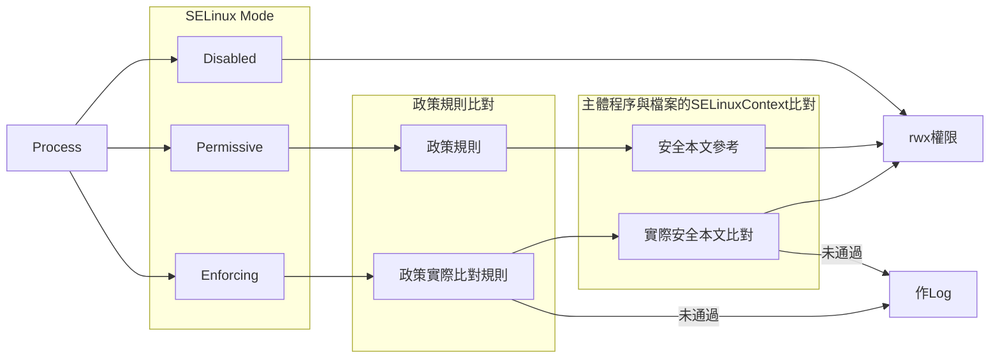

# SELinux - Security Enhanced Linux

- 2018/09/05

1. 自主式存取控制(DAC) : Linux 的基本權限機制
2. 委任式存取控制(MAC) : Linux 安全強化機制


## SELinux 概念

> 好久以前, 美國國家安全 局研究了老半天, 發現系統出問題,多半原因都是內部員工的資源誤用所造成. 因此搞出了一套訂定 **政策規則 : 讓 程序(主體) 可以讀取 檔案(目標)**. 

ex: 單純只有 DAC 的話 : 警察可以拿槍來掃射 ; 如果再附加 MAC 的話 : 執法中的警察(主體)可以拿槍(目標)來掃射




## 

```sh
$ grep -v '^#' /etc/sysconfig/selinux 

SELINUX=enforcing
SELINUXTYPE=targeted
```

```sh
# 查看 安全性本文 內容
$ ls -Z /home
drwx--x---+ tony tony unconfined_u:object_r:user_home_dir_t:s0 tony
                      ------------ -------- --------------- --
                        A(不重要)   B(不重要)     C(重要)      D(不重要)
# A: user
#   - unconfined_u : 不受SELinux管制的用戶
#   - system_u : 系統自己產生
#
# B: role
#   - object_r : File(或Dir)
#   - system_r : Process
#
# C: type
#   - Type : 作用在 檔案
#   - Domain : 作用在 程序
#
# D: sensitivity
#   - 不明 @_@
```

- 安全性本文(Security Context) : `程序的安全性本文` = `檔案的安全性本文` 才可以順利存取


# 備註

- 自主式存取控制(DAC) : Discretionary Access Control
- 委任式存取控制(MAC) : Mandatory Access Control