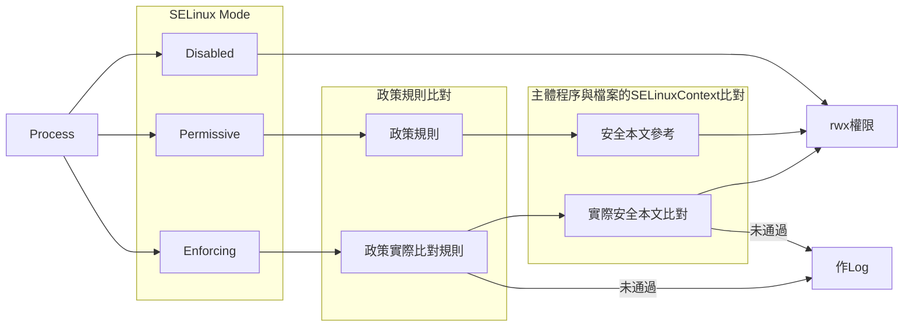

# SELinux - Security Enhanced Linux

- 2018/09/05

1. 自主式存取控制(DAC) : Linux 的基本權限機制 ( rw-rw-r--  這些東西啦)
2. 委任式存取控制(MAC) : Linux 安全強化機制


# 相關指令

```sh
$ getenforce

### stop selinux
$# setenforce 0

### disable selinux
$# sed -i 's/^SELINUX=enforcing$/SELINUX=permissive/' /etc/selinux/config

# (不建議使用) 直接改變 SELinux Context (但 重置or重開機後, 將會還原)
$# chcon -t <context label> <file>

# 還原 特定檔案的 context (-v: 查看改變前後)
$# restorecon -v <file>

# 同上, 但會做 recursive 重置 context
$# restorecon -Rv <dir>

# 列出所有 SELinux Context
$# semanage fcontext -l

$# ps axZ

$# ps -ZC

$ ls -Z

# 查看 SELinux Policy
$ getsebool -a

# 啟用 httpd_enable_homedirs (start 的概念)
$# setsebool httpd_enable_homedirs on

# setsebool httpd_enable_homedirs (enable 的概念)
$# setsebool -P httpd_enable_homedirs on

# 列出所有 SELinux Boolean
$# semanage boolean -l
```


## SELinux 概念

> 好久以前, 美國CIA 研究了老半天, 發現系統出問題,多半原因都是內部員工的資源誤用所造成. 因此搞出了一套訂定 **政策規則 : 讓 程序(主體) 可以讀取 檔案(目標)**. 

ex: 單純只有 DAC 的話 : 警察可以拿槍來掃射 ; 如果再附加 MAC 的話 : 執法中的警察(主體)可以拿槍(目標)來掃射




## SELinux 組態設定檔

```sh
# show 出非註解的部分
$ grep -v '^#' /etc/sysconfig/selinux 

SELINUX=enforcing
SELINUXTYPE=targeted
```


## 安全性本文(SELinux contect)

- 安全性本文 : `程序的安全性本文` = `檔案的安全性本文` 才可以順利存取
- `ps`, `ls`, `cp`, `mkdir` 都可以搭配 `-Z`

SELinux contect 的繼承規則:
- `vim`, `cp`, `touch` 所產生的檔案, 會繼承自資料夾
- `mv`, `cp -a` 會保留原本的 SELinux context

```sh
# 查看 安全性本文 內容
$ ls -Z /home
drwx--x---+ tony tony unconfined_u:object_r:user_home_dir_t:s0 tony
                      ------------ -------- --------------- --
                       A(不重要)   B(不重要)     C(重要)      D(不重要)

# A: user
#   - unconfined_u : 不受SELinux管制的用戶
#   - system_u : 系統自己產生
#
# B: role
#   - object_r : File(或Dir)
#   - system_r : Process
#
# C: type
#   - Type : 作用在 檔案
#   - Domain : 作用在 程序
#
# D: sensitivity
#   - 不明 @_@
```


## SELinux Mode

SELinux 有三種模式: `Enforcing`, `Permissive`, `Disabled`

```sh
# 查看 SElinux 模式
$ getenforce
Enforcing

# 設定 SELinux 模式
$ sudo setenforce 1     # 1(Enforcing) / 0(Permissive)

# 查看 SELinux Boolean
$ getsebool -a
# 會出現好幾百項...(搭配 grep 找關鍵字)
```


## 改變 SELinux Context

```sh
$# semanage fcontext -[atfd]
# -a : 增加
# -t : type
# -f : 強制
# -d : 刪除

rm -rf /virtual
mkdir /virtual
touch /virtual/index.html

ls -Zd /virtual

ls -Z /virtual

# 增加 SELinux Context, 指定 /virtual/ 底下的東西, 要套用 httpd_sys_content_t
semanage fcontext -a -t httpd_sys_content_t '/virtual(/.*)?'
# 重置 /virtual 底下的 SELinux Context
restorecon -RFv /virtual

ls -Zd /virtual

ls -Z /virtual

rm -rf /virtual

```


# 備註

- 自主式存取控制(DAC) : Discretionary Access Control
- 委任式存取控制(MAC) : Mandatory Access Control
- 安全性本文 : Security Context
- 安全脈絡標籤 : SELinux Context
