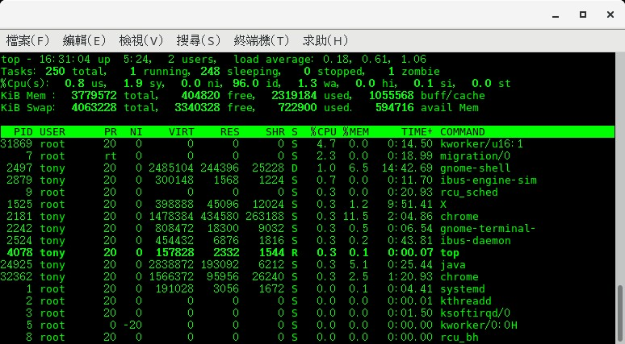

# 程序管理

[觀察程序 ps](http://linux.vbird.org/linux_basic/0440processcontrol.php#ps)

```sh
# 只能查閱自己的 bash程序
$ ps -l

# 查閱所有系統運作的程序
$ ps aux
```


## - 行程狀態 相關指令
```sh
# 僅列出與自己相關的bash相關程序
$ ps
  PID TTY          TIME CMD
 9342 pts/2    00:00:00 bash
11937 pts/2    00:00:00 ps

# 詳細資訊
$ ps -f
UID        PID  PPID  C STIME TTY          TIME CMD
tony     24634 24626  0 13:58 pts/0    00:00:00 bash
tony     32620 24634  0 20:58 pts/0    00:00:00 ps -f

# 更多詳細資訊
$ ps -l
F S   UID   PID  PPID  C PRI  NI ADDR SZ WCHAN  TTY          TIME CMD
0 S  1000  9342  7534  0  80   0 - 29176 wait   pts/2    00:00:00 bash
0 R  1000 11944  9342  0  80   0 - 37232 -      pts/2    00:00:00 ps
# PPID: Parent Process ID

# 列出系統運作的程序
$ ps aux | grep mysqld
USER       PID %CPU %MEM    VSZ   RSS TTY      STAT START   TIME COMMAND
tony       919  0.0  0.0 112668   964 pts/0    S+   21:36   0:00 grep --color=auto mysqld
mysql     2941  0.1  4.9 1248528 186788 ?      Sl    3月01   1:52 /usr/sbin/mysqld --daemonize --pid-file=/var/run/mysqld/mysqld.pid
#           重點
# USER      Y       Process Owner
# PID       Y       Process ID
# %CPU              CUP usage %
# %MEM              Memory usage %
# VSZ               虛擬Memory usage (KB)
# RSS               固定佔用的Memory (KB)
# TTY               Process is from which Terminal(若為系統服務, 則為 ?)
# STAT              Process目前狀態. S:休眠中; R:執行中
# START             Process被啟動的日期
# TIME              實際使用CPU時間
# COMMAND   Y       Process的命令

# 樹狀結構列出 System Procss
$ pstree
systemd─┬─ModemManager───2*[{ModemManager}]
        ├─NetworkManager───2*[{NetworkManager}]
        ├─2*[abrt-watch-log]
        ├─abrtd
        ├─accounts-daemon───2*[{accounts-daemon}]
        ├─alsactl
        ...(略)

# 背景睡覺 60秒
$ sleep 60 &        # sleep 60 seconds
$ ps -f
UID        PID  PPID  C STIME TTY          TIME CMD
tony      1559 24634  0 21:59 pts/0    00:00:00 sleep 60
tony      1563 24634  0 21:59 pts/0    00:00:00 ps -f
tony     24634 24626  0 13:58 pts/0    00:00:00 bash

# 前景作業改背景作業, 使用 Ctrl+z中斷, 再用 bg指令, 將上一個被停止的行程放入背景中執行.
$ sleep 60
^Z
[1]+  Stopped                 sleep 60
$ bg
[1]+ sleep 60 &
$ ps -f
UID        PID  PPID  C STIME TTY          TIME CMD
tony      1713  1705  0 22:01 pts/2    00:00:00 bash
tony      1763  1713  0 22:01 pts/2    00:00:00 sleep 60
tony      1770  1713  0 22:02 pts/2    00:00:00 ps -f

# 將背景取回前景 fg
$ jobs
$ sleep 50 &
[1] 2138
$ sleep 40 &
[2] 2142
$ sleep 30 &
[3] 2146
$ jobs
[1]   Running                 sleep 50 &
[2]-  Running                 sleep 40 &
[3]+  Running                 sleep 30 &
$ fg 2          # 取出第二個背景行程
sleep 40
^C              # 中斷

# nice value NI value, 行程優先權(priority)
$ ps l
F   UID   PID  PPID PRI  NI    VSZ   RSS WCHAN  STAT TTY        TIME COMMAND
0  1000  1959  1951  20   0 116568  3232 wait   Ss   pts/0      0:00 bash
0  1000  2198  1959  20   0 148936  1452 -      R+   pts/0      0:00 ps l
0  1000 24277 24261  20   0 116560  3224 n_tty_ Ss+  pts/1      0:00 /bin/bash
# NI為 [-20, 19], 越小越優先, 預設為 0
```


## - top(類似Windows的工作管理員)
[使用 top](http://linux.vbird.org/linux_basic/0440processcontrol/0440processcontrol-fc4.php#top)

內容大致如下（上半部：Resource資訊,下半部：Process資訊)



```
# 第一行
top - 14:53:56                                  目前時間
up 3:47                                         累積開機時間
load average: 0.84, 0.82, 0.70                  系統每 1, 5, 15分鐘平均執行的行程數
```

top後操作指令 | 說明 |
--- | --- |
h | Help |
P | 依據CPU使用時間排序 |
M | 依據記憶體使用量排序 |
T | 依據執行時間排序 |
N | 依據PID大小排序 |
u | 只列出該帳號的程序 |
k | 刪除 |
d | 更新秒數 |
q | 離開 |


## jobs 工作管理 && fg
> jobs參數, `l: 顯示 PID`, `r: running process`, `s: stopped process`
> 預設, Ctrl+z後, 都會暫停此 process
```sh
$ vi ~/.bashrc        # Ctrl + z
[1]+  Stopped                 vi .bashrc

$ mysql -uroot -p     # Ctrl + z
[2]+  Stopped                 mysql -uroot -p

$ jobs -lrs
[1]- 19499 Stopped                 mysql -uroot -p  (wd: /home/tony)
[2]+ 19504 Stopped                 vi .bashrc

$ fg              # 可以回到上面有「+」的那個 process

$ fg %1           # 可以回到第1個 process
---
## 虛擬檔案
> `/proc`內的檔案, 都是虛擬檔案, 是系統讓使用者查看系統內部狀況的窗口

```sh
# 查看記憶體使用情形
$ cat /proc/meminfo

# 查看檔案分割資訊
$ cat /proc/partitions

# 查看 CPU資訊
$ cat /proc/cpuinfo
```
