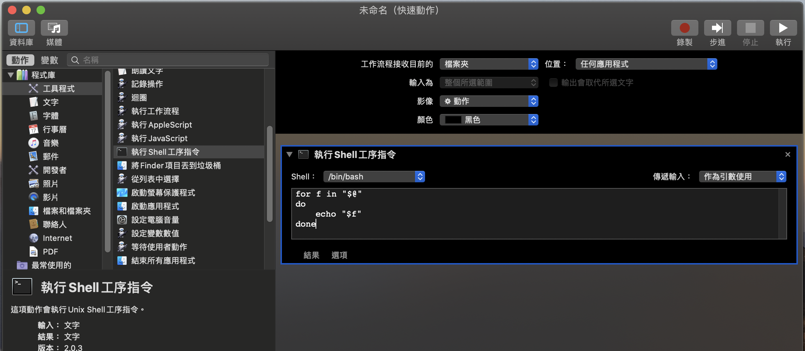

# printscreen

- command + shift + 3 > 畫面儲存到桌面 （printscreen)
- command +
- command + shift + 4 > 選取區塊, 存到桌面

# 製作 Open With VSCode

- https://blog.csdn.net/u013069892/article/details/83147239



1. command + space
2. automator
3. 快速動作 > 選擇
4. (左)工具程式 > (中)執行Shell工序指令 拖拉到右邊
5. (上)工作流程接收目前的 > 檔案夾
6. (上)位置 > Finder
7. 裡面輸入
```bash
for f in "$@"
do
    open -a "Visual Studio Code" "$f"
done
```