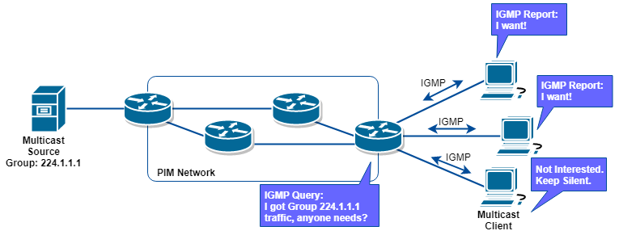

# 網際網路 與 網路架構
- 2018/05/17
- UCOM - NINS 上課筆記
- 網管的東西


# 網路的一些基本概念 (好像也不是非常重要)
> 網路有 2個派系: `ISO` 及 `IEEE`. ISO(1970) 提出了個 成本很貴的 OSI 7層協定; IEEE(1982) 提出了一連串的網路協定

Standard     | Description
------------ | -------------
IEEE 802.3   | Ethernet (乙太網路)
IEEE 802.11  | Wireless LAN & Mesh (無線區域網路)
IEEE 802.15  | Wireless PAN (藍芽)
...          | 還有其他 9487 種...

> 早期, *網路卡製造商* 都會在 **網路卡** 上面 直接燒錄 `Mac Address(實體位置)` 在它的 ROM 上面, 但還是會有 不同網卡有相同 `Mac Address` 的事情發生(2個人相同身分證字號啦!!). 所以, 近一、二十年來, 都改成可以用 *驅動程式* 來更改 `Mac Address` 了.

## 802.3 - Ethernet 乙太網路
- 使用 CSMA/CD 傳輸資料
- 現今 `乙太網路標準` 分為 2 個: 一個由 DEC、Intl、Xerox 共同制定的 `DIX乙太網路標準`; 另一個是由 IEEE 802委員會所制定的 `IEEE 802.3乙太網路標準`

## 802.11 - Wireless LAN 無線區域網路
- 採用 CSMA/CA 傳輸資料
- 傳輸資料分為 2 種, 一種是 **有透過 AP傳輸** ; 一種是 **沒有透過 AP傳輸** (也稱為 `Ad-Hoc`). note: AP(Access Point)

## 802.15 - Wireless PAN 藍芽
- (我還不知道它怎麼傳輸資料...)


# 網路設備

依照功能區分
1. 信號再生器(Repeater)
2. 集線器(Hub)
3. 橋接器(Bridge)
4. 交換器(Switch)
5. 路由器(Router)
6. 閘道器(Gateway)


## 1. 信號再生器(Repeater)
-  OSI `實體層` 的運作
- 因為 *數位訊號* (一堆 0 跟 1) 傳輸時會衰退, 重製數位訊號, 來增加傳輸距離
- 它只知道 **訊號來了, 我就重製它, 再把它傳出去**, 它 **看不懂訊號** 的意義


## 2. 集線器(Hub)
-  OSI `實體層` 的運作
- 依照 `會不會對訊號作 重製/再生`(需不需要插電(大誤)), 分為 `Active Hub(要插電)` 跟 `Passive Hub(不用插電)`
- 現今多數都是 `Active Hub`
- `Active Hub` 幾乎涵蓋了 **Repeater** 的功能了~
- `Active Hub` 還可增加 SNMP(Simple Network Management Protocol) 的模組, 來 `監控網路的狀況`


## 3. 橋接器(Bridge)
- 屬於 OSI `資料連結層` 的運作 (只認得`實體位置` 只認得`實體位置` 只認得`實體位置` )
- 主要功能: `轉送廣播訊框, 篩選直接訊框`
- 依照 `MAC Address` 決定資料傳輸的方向, 來提高網路效率
- 它懂 `訊框` , 但看不懂 `封包`
- 收到 封包 時, 會查詢`路由表(Routing Table), 或稱為 橋接表(Bridge Table)`, 來決定是否要傳輸到其他區段 or 只傳輸到自己的區段
- 橋接器 收到資料, 會 **自動學習** 網路所在的 電腦硬體位置
- 目的之一, 讓網路上的 `各個網段獨立運作`, 各自網路流量不會互相影響
- 設計不良的網路架構, 會產生 `廣播風暴`, 會如何我也不知道.... 細節就不寫了...
- 依照 ? 可分為 3 類
    - Unicast   一對一  單點傳送
    - Multicast 一對多  多址傳播
    - Broadcast 一對全  廣播


## 4. 交換器(Switch)
- 屬於 OSI `資料連結層` 的運作(狹義上), 基本上, 它具有 **橋接器** 的功能
- **企業級的交換器** 通常可進行 `虛擬區域網路的分割`, 將一台 實體交換器, 設定成 多台虛擬且獨立的交換器
- 交換器 有2個以上的 通道, 對每一個 port提供 獨享頻寬
- 轉送 **廣播訊框** ; 篩選 **直接訊框** ; 提供 **保障頻寬**


## 5. 路由器(Router)
- 屬於 OSI `網路層` 的運作
- 主要目的: 切割網域
- 看得懂 `IP Address`
- 可以隔離網路的廣播(能有效避免 `廣播風暴`)
- 進行 `封包切割`, 用以連接 `MTU(最大傳輸單位)` 大小不一致的異質性網路
    - ex: LAN data frame 1.5k ; WAN data frame 0.5k


## 6. 閘道器(Gateway)
- 屬於 OSI `傳輸層(以上)` 的運作 (現在大多是電腦軟體了)
- 讓 不同網路協定 的資料可以相互傳輸 (講不同語言的人互相溝通的翻譯人員啦!!)


# TCP/IP Protocol


Source: https://www.distributednetworks.com/dhcp-tcp-ip/module3/images/protocol_main.gif

- 應用程式層 Application
    - `TCP模型` 與 `應用程式` 的中介, 協同運作、資料交換介面 等
    - 常見的有:
        - Hypertext Transfer Protocol (HTTP)
        - File Transfer Protocol (FTP)
        - Simple Mail Transfer Protocol (SMTP)
        - Terminal Emulation Protocol (Telnet)
        - Domain Name System (DNS) : 主機名稱 解析為 ip
        - Routing Information Protocol (RIP) : 動態路由通訊協定之一
        - Simple Network Management Protocol (SNMP) : 網路管理的通訊協定
- (主機)傳輸層 Transport
    - 應用程式之間的 `點對點通訊`
    - 只提供 `路由` 與 `定址` 的判斷 (封包收送後排序)
    - 又分為 `TCP` 及 `UDP`:
        - Transmission Control Protocol (TCP) : 可靠、連線導向、較慢
        - User Datagram Protocol (UDP) : 不可靠、非連線導向、較快, 可由 `上層應用程式提供可靠的傳遞`
- 網際網路層 Internet Layer
    - 將`傳輸層` 來的東西, 加入 `表頭`
    - 路由資訊、傳送選項, 作重要的是 **`作路由`**
    - 此層次的主要協定又有:
        - Address Resolution Protocol (ARP) - IP Address 轉 Mac Address
        - Internet Control Message Protocol (ICMP) - 偵測 及 回報IP封包錯誤訊息
        - Internet Group Management Protocol (IGMP) - 負責管理 *Multicast 群組*
        - Internet Protocol (IP) - 可路由的通訊協定, 負責 `定址`、`路由`、`切割`、`重組`封包

- 網路介面層 Network Interface Layer
    - 收發資料(實體訊框 Frame)
    - 發送 ip 對應到 mac address
    - 跨不同協定運作
- 主機 (ip), 程式 (port)
- UDP 具備 `錯誤控制`(丟~丟~丟~)
- IPv4 分為:
    1. unicast      可跨 router
    2. multicast    是否跨 router, 看 IP 反 router 的設定
    3. broadcast    不能跨 router
- For 「Windows 10」, 「C:\Windows\System32\drivers\etc\protocol」裏頭有 protocol:port 對照表


## Internet Protocol (IP)
- 封包的 `切割` 、 `重組` 、 `定址` 、 `轉送`
    - 重組切割, ex: router兩端, 一邊 wifi, 一邊 Ethernet (MTU 不同)
- IP 協定不會確認對方在不在(不建立 Session、分連接導向)
- 可以依靠 `TCP` or `應用程式` 來負責 `可靠的資料傳遞`


## Transmission Coltrol Protocol (TCP)
- 先建立 Session, 建立連線; 連接導向; Three-Ways HandShake
- Byte-Stream
- Port 對應 端點
- 具備 `流量控制` + `錯誤控制`
- 只支援 `unitcast`(因為得三向交握); 無 multicast、broadcast
- 等待ˋ緩衝的資料量之後才進行傳送, 也允許「Push」機制強行送出
- 可靠 
    - Sequence numbers 序號
    - Acknowledgements 確認 


## User Datagram Protocol (UDP)
- 支援 unicast、multicast、broadcast


## Internet Control Message Protocol (ICMP)
- 偵測網路連線狀況與路由分析, 找到快速回家的路(ICMP Redirect)
- 預設來講, 為了避免封包被無止境轉送, 弄出了 `TTL`, TTL = default - n
```powershell
> ping 168.95.1.1
回覆自 168.95.1.1: 位元組=32 時間=4ms TTL=244
# 每遇到一個 router, TTL 減 1
...(略)...
```
- For Windows, default TTL = 128
- for Linux,   default TTL = 255


## Address Resolution Protocol (ARP)
- 解析 `IP Address` 對應的 `Mac Address`(使用 `Broadcast` 取得)
- 分為 **動態快取** 及 **靜態快取**
    - 動態快取 - 透過 ARP協定 運作而自動加入
    - 靜態快取 - 使用者自行手動新增, 語法: `arp -s <ip address> <mac address>`
- IPv4 才有這東西; IPv6沒有

```powershell
> arp -d <ip address>               # 移除快取
> arp -s <ip address> <mac address> # 儲存至快取(手動設定的話可能會設錯, or 對方換 ip)
> arp -a                            # 顯示所有網路介面卡的快取列表

介面: 10.0.75.1 --- 0xb
  網際網路網址          實體位址               類型
  10.0.75.255           ff-ff-ff-ff-ff-ff     靜態
  ...(略)...

介面: 192.168.100.5 --- 0xd
  網際網路網址          實體位址               類型
  192.168.100.1         74-5a-aa-eb-93-70     動態
  192.168.100.255       ff-ff-ff-ff-ff-ff     靜態      # 這是 broadcast (全為 1)
  ...(略)...

介面: 192.168.134.1 --- 0xf
  網際網路網址          實體位址               類型
  192.168.134.255       ff-ff-ff-ff-ff-ff     靜態
  ...(略)...

介面: 192.168.220.1 --- 0x12
  網際網路網址          實體位址               類型
  192.168.220.255       ff-ff-ff-ff-ff-ff     靜態
  ...(略)...

介面: 172.20.61.209 --- 0x19
  網際網路網址          實體位址               類型
  224.0.0.2             01-00-5e-00-00-02     靜態
  ...(略)...
```


## Internet Group Management Protocol (IGMP)
- class D 的領域... `[224~239].xxx.xxx.xxx`
- 群播(Multicast)機制
- 主機需要設定多址傳送等級
    - 等級0 : 不支援 傳送/接收
    - 等級1 : 　支援 傳送; 不支援 接收
    - 等級2 : 　支援 傳送/接收 (近十年內的 Windows 系列幾乎都這個)


Source: https://www.jannet.hk/content/public/upload/igmp/01.png


## 其他
- 查看封包的好用軟體 `Wireshark`, 使用 `packet driver` 來擷取訊框
- DHCP: 為 bootp 的進化版