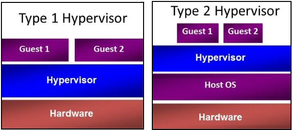

# Windows 的 Hyper-V
- 2018/05/08


# 虛擬化技術具備4個主要元件:
1. 虛擬化實體主機的硬體資源(硬體層)
2. 安裝在實體主機上的作業系統(Hosted OS)
3. 虛擬機器(Guest)
4. 負責虛擬主機運作的虛擬機器監視器(VMM)


# 虛擬化的 Hypervisor 有兩種架構:

Source: http://www.computerperformance.co.uk/win8/windows8-hyper-v.htm

Structure     | Type 1 (裸機式)                | Type 2 (主機式)
------------- | ----------------------------- | ---------------
Name          | Bare-Metal Architecture　　　  | Hosted Architecture
Efficiency    | Good                    　　　 | Bad
Compatibility | Bad (Need Reboot)       　　　 | Good

Type 1 產品: `VMware ESX/ESXi` 、 `Microsoft Hyper-V` 、 `RedHat KVM` ...

Type 2 產品: `早期VMware Workstation/Fusion` 、 `Microsoft Virtual PC/Server` 、 `Sun VirtualBox` ...

VMware Server 是 VMware公司免費提供


# CPU
### 1. Pyhsical Processor - Processor
    真實 CPU Socket

### 2. Logical Processor - Threading
    邏輯 CPU, 依是否支援 Hyper-Threading 可區分為:
    1. 不支援HT, 緒 = 核心 * 1
    2. 　支援HT, 緒 = 核心 * 2

### 3. Virtual Processor
    以開機的 VM 的 虛擬CPU


## 檢查電腦是否能用 Hyper-V 
```cmd
:: 使用環境
> systeminfo
主機名稱:             (~隱藏~)
作業系統名稱:         Microsoft Windows 10 專業版
作業系統版本:         10.0.16299 N/A 組建 16299
...(略)...
系統型號:             P553UJ
系統類型:             x64-based PC
處理器:               已安裝 1 處理器。
                      [01]: Intel64 Family 6 Model 78 Stepping 3 GenuineIntel ~2492 Mhz
BIOS 版本:            ASUSTeK COMPUTER INC. P553UJ.302, 2016/7/1
Windows 目錄:         C:\WINDOWS
系統目錄:             C:\WINDOWS\system32
開機裝置:             \Device\HarddiskVolume1
系統地區設定:         zh-tw;中文 (台灣)
輸入法地區設定:       zh-tw;中文 (台灣)
時區:                 (UTC+08:00) 台北
實體記憶體總計:       8,088 MB
可用實體記憶體:       3,326 MB
虛擬記憶體: 大小上限: 12,362 MB
虛擬記憶體: 可用:     4,330 MB
虛擬記憶體: 使用中:   8,032 MB
...(略)...
網路卡:               已安裝 3 NIC。
                      [01]: Intel(R) Dual Band Wireless-AC 8260
                            連線名稱:           Wi-Fi
                            狀態:               媒體已中斷連線
                      [02]: Realtek PCIe GBE Family Controller
                            連線名稱:           乙太網路
                            DHCP 已啟用:          是
                            DHCP 伺服器:        192.168.2.220
                            IP 位址
                            [01]: 192.168.124.94
                            [02]: fe80::f060:35d6:4150:3457
                      [03]: Hyper-V Virtual Ethernet Adapter
                            連線名稱:           vEthernet (預設切換)
                            DHCP 已啟用:          是
                            DHCP 伺服器:        255.255.255.255
                            IP 位址
                            [01]: 172.19.242.97
                            [02]: fe80::1cb4:7ca5:8cf9:a8d1
Hyper-V 需求:         偵測到 Hypervisor。將不會顯示 Hyper-V 所需的功能。
```


# 可以使用 2個工具來檢測 `系統是否符合 Hyper-V的需` 
1. [SecurAble](https://www.grc.com/securable.htm)

直接執行程式即可. 必須在尚未啟動 Hyper-V 之前執行才能得到正確結果

2. [Coreinfo](https://docs.microsoft.com/zh-tw/sysinternals/downloads/coreinfo)

解壓縮後, 使用 admin 執行
```cmd
> Coreinfo -v
```


# 其他指令備註
```cmd
:: 查看開機載入組態
> bcdedit

Windows 開機管理程式
--------------------
identifier              {bootmgr}
device                  partition=\Device\HarddiskVolume1
path                    \EFI\Microsoft\Boot\bootmgfw.efi
description             Windows Boot Manager
locale                  zh-TW
inherit                 {globalsettings}
badmemoryaccess         Yes
default                 {current}
resumeobject            {(~隱藏~)}
displayorder            {current}
toolsdisplayorder       {memdiag}
timeout                 0

Windows 開機載入器
-------------------
identifier              {current}
device                  partition=C:
path                    \WINDOWS\system32\winload.efi
description             Windows 10
locale                  zh-TW
inherit                 {bootloadersettings}
recoverysequence        {(~隱藏~)}
displaymessageoverride  Recovery
recoveryenabled         Yes
badmemoryaccess         Yes
isolatedcontext         Yes
allowedinmemorysettings 0x15000075
osdevice                partition=C:
systemroot              \WINDOWS
resumeobject            {(~隱藏~)}
nx                      OptIn
bootmenupolicy          Standard
hypervisorlaunchtype    Auto
```

