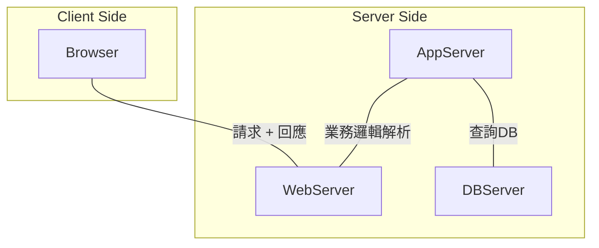
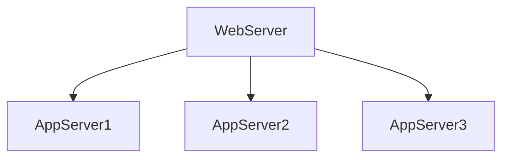

# `Web Server` && `Application Server` 傻傻分不清楚
- 2018/07/29
- 使用 VSCode開啟, 並且安裝 [Markdown Preview Mermaid Support 1.0.0](https://marketplace.visualstudio.com/items?itemName=bierner.markdown-mermaid) 即可正常解析流程圖部分
- Web Server
- HTTP Server
- Application Server(App Server)

`Web Server` 多數情況下, 與 `HTTP Server` 指的是相同的東西 (都依賴 `HTTP協定`), 也就是說, `Web Server` 也可以依賴其他協定...

# Web Server 與 App Server 示意圖

# App Server 的 Load Balance

# - Web Server

回應 **靜態文件** , ex: `HTML page`, `image`, `js`, `css`, 只提供「Server-Side程式可執行的環境」, 收Request, 給Response

Web Server 也負責處理 `fault-tolerance` 及 `scalability` 等等業務, ex: `load balancing`, `caching`, `clustering` 等等

# - Application Server (App Server)

多數情況下, client 與 app server 之間的業務邏輯, 皆由 API 來進行互動

App Server 負責處理 `security`, `transaction`, `resource pooling`, `messaging` 等業務, 另外, App Server也有 `fault-tolerance` 及 `scalability` 的機制.