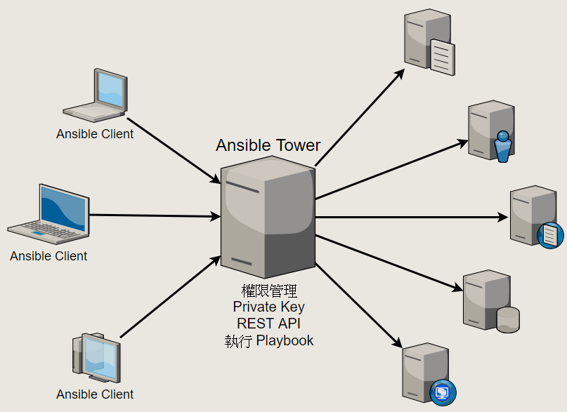

# Ansible

- 2019/01/12
- 這東西可以快速部署一群遠端主機(透過 ssh, 使用 PKI 認證)



## Terms

- Ansible Tower  : 針對企業用戶的收費軟體.
- Playbook       : Ansible 指令搞的名稱 (YAML) ; 可被 Ansible 執行的 YAML file.
- Host Inventory : 主機目錄, 主機清單, 此為設定檔
- YAML           : YAML Ain't a Markup Language

```yml
### playbook example
---
- hosts: web
  remote_user: root
  tasks:
  - name: install httpd
    yum: pkg=httpd state=latest
```


## Structure

```sh
/etc
    /ansible/       # ansible 組態目錄
        /ansible.cfg    # ansible 設定主檔
        /hosts          # ansible 自己管理的 主機清單
        /roles/
/usr/
    /share/             # 模組位置
$HOME/
    /.ansible/
        /tmp/           # remote_tmp 及 local_tmp

### 設定檔順序
# Ansible 預設組態主檔 /etc/ansible/ansible.cfg
# 設定檔參考順序為(先找到先適用):
# 1. ANSIBLE_CONFIG (環境變數)
# 2. ansible.cfg (current dir)
# 3. .ansible.cfg (home dir)
# 4. /etc/ansible/ansible.cfg (最後才參考設定主檔)
```

`主機目錄` 依照用途可分為: `DB Nodes`, `Service Nodes`, ...

### 主機目錄

```sh
### 簡單寫法 ----------
192.168.124.101
www.tony.com
mail.tony.com

### 分組寫法 ----------
[webservers]
app.tony.com
www.tony.com

[dbservers]
mysql.tony.com
ms.tony.com
mongo.tony.com
```


## Ansible 指令

### 1. Ansible CLI

Ansible 的指令工具, 又稱為 `Ad-Hoc Commands`

```sh
### 指令格式
ansible <host-pattern> [options]

ansible -m <模組名稱>
ansible -a <模組的參數>
```

Example:

```sh
### 檢查所有主機, 是否以 tony 建立了 Ansible 管理主機可存取的環境
$ ansible all -m ping -u tony

### 所有主機, 與目前 bash 相同使用者, 在遠端主機執行 'echo hi~'
$ ansible all -a "/bin/echo hi~"

### 複製 /etc/hosts 到 db 這台的 /home/tony/hosts
$ ansible db -m copy -a "src=/etc/hosts dest=/home/tony/hosts"

### app 這台, 安裝套件
$ ansible app -m yum -a "name=acme state=present"

### 所有主機建立使用者
$ ansible all -m user -a "name=cool21540125 password=<加密後密碼>"

### web 這台, 下載 Git repo
$ ansible web -m git -a "repo=git@github.com:cool21540125/documentation-notes.git dest=/tmp/illu version=HEAD"

### app2 這台, 啟動服務
$ ansible app2 -m service -a "name=httpd state=started"

### lb 這台, 並存 10 個重啟
$ ansible lb -a "/sbin/reboot" -f 10

### 檢查所有主機, 全部系統資訊
$ ansible all -m setup
```

### 2. Ansible Playbook

#### 關鍵字

- hosts       : 遠端主機 IP
- remote_user : 執行身分
- vars        : 變數
- tasks       : Playbook 核心 ; `循序執行的 Action`, 每個 Action 呼叫一個 `Ansible Module(Ansible 的指令啦)`
    - action 語法: `module:module_params=module_value`
    - 常用 module : cd, ls, yum, copy, template, ...
- handlers    : Playbook 的 事件處理方式(多次觸發只執行一次, ex: 重開機後...)

#### Playbook 格式

```sh
### 執行方式
ansible-playbook deploy.yml

### Playbook 內:
模組名稱: 模組的參數
```

#### Example:

```yaml
### deploy.yaml
# 安裝 Apache && 改設定檔 && 寫 index.html && 啟動 Apache
---
- hosts: web

  vars:
    http_port: 80
    max_clients: 800

  remote_user: root

  tasks:
  # taks1
  - name: install apache in the newest version
    yum: pkg=httpd state=latest

  # task2
  - name: config file
    template: src=templates/httpd.conf.j2 dest=/etc/httpd/conf/httpd.conf
    notify:
    - restart apache
    # notify 這裡是 [] 的概念, 看下面 json 就可懂了

  # task3
  - name: index file
    template: src=templates/index.html.j2 dest=/var/www/html/index.html

  # task4
  - name: start apache
    service: name=httpd state=started

handlers:
  - name: restart apache
    service: name=httpd state=restarted
```

```js
// deploy.yaml -> deploy.json
// 上面那包, 也可改成 json
[
    {
        "hosts": "web",
        "vars": {
            "http_port": 80,
            "max_clients": 800
        },
        "remote_user": "root",
        "tasks": [
            {
                "name": "install apache in the newest version",
                "yum": "pkg=httpd state=latest"
            }, {
                "name": "config file",
                "template": "src=templates/httpd.conf.j2 dest=/etc/httpd/conf/httpd.conf",
                "notify": [             // 這邊也可了解上面為啥 yaml 要分兩行...
                    "restart apache"
                ]
            }, {
                "name": "index file",
                "template": "src=templates/index.html.j2 dest=/var/www/html/index.html"
            }, {
                "name": "start apache",
                "service": "name=httpd state=started"
            }
        ],
        "handlers": [
            {
                "name": "restart apache",
                "service": "name=httpd state=restarted"
            }
        ]
    },
]
```

## 常用模組(Ansible 基本功)

### 1. ping
### 2. debug
### 3. copy
### 4. template
### 5. file
### 6. user
### 7. yum
### 8. service
### 9. firewalld
### 10. shell
### 11. command


## Example

- 2019/01/12
- 安裝 httpd 的 yml 寫法

由 Ansible Tower 使用此腳本, 在遠端 (95) 安裝 httpd

```yml
- hosts: 192.168.124.95
  remote_user: root
  tasks:
  - name: install httpd
    yum: pkg=httpd state=latest

  - name: start
    service: name=httpd state=started
```

