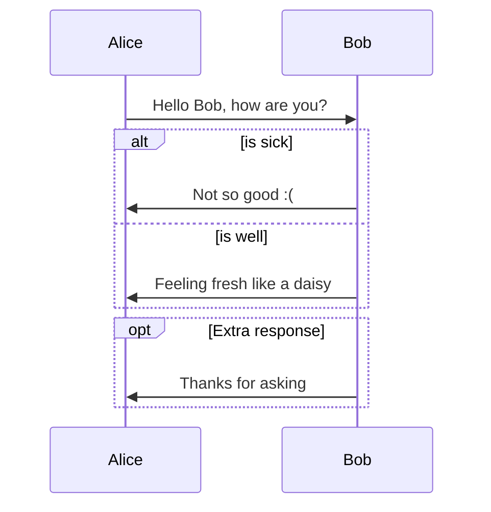

# 流程圖

- [Markdown Mermaid for VSCode](https://marketplace.visualstudio.com/items?itemName=bierner.markdown-mermaid)

帥!

- [Draw Diagrams With Markdown](https://support.typora.io/Draw-Diagrams-With-Markdown/)
