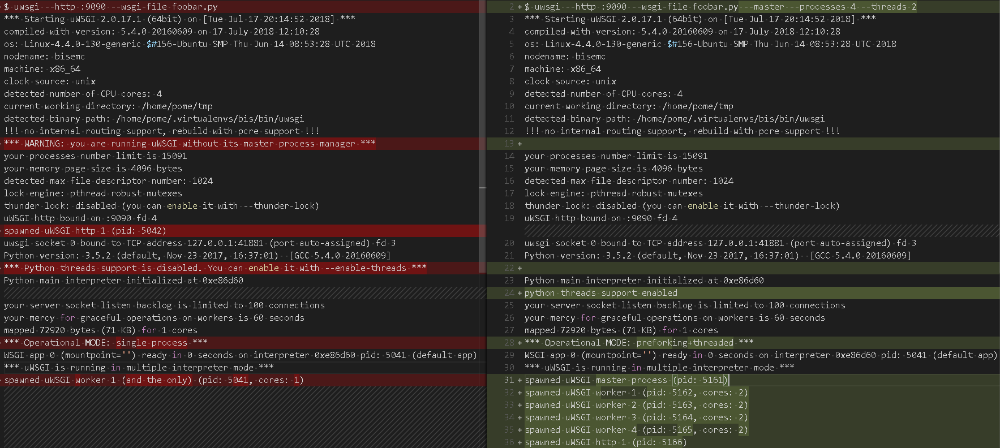

# uwsgi  v2.0.17.1
- 2018/07/17


```py
# 這是一個 遵從 WSGI 的 application
# foobar.py
def application(env, start_response):
    start_response('200 OK', [('Content-Type','text/html')])
    return [b"Hello World"] # 這是 Python3
```


```sh
# 預設來講, uWSGI Python Loader 會去找 「Application Function」
# 若有前端程式, 使用 「--http-socket」 代替 「--http」
$ uwsgi --http :9090 --wsgi-file foobar.py
# 見比較圖
```


Client
```sh
$ curl -X GET http://127.0.0.1:9090
Hello World
```

Server
```sh
[pid: 5041|app: 0|req: 4/4] 127.0.0.1 () {28 vars in 288 bytes} [Tue Jul 17 20:23:01 2018] GET / => generated 11 bytes in 0 msecs (HTTP/1.1 200) 1 headers in 44 bytes (1 switches on core 0)
```

Option           | Description
---------------- | --------------
--processes 4    | 4核
--threads 2      | 2緒

```sh
# 4核 && 2緒
$ uwsgi --http :9090 --wsgi-file foobar.py --master --processes 4 --threads 2
# 見比較圖
```

Server
```sh
[pid: 5162|app: 0|req: 1/1] 127.0.0.1 () {28 vars in 288 bytes} [Tue Jul 17 20:46:50 2018] GET / => generated 11 bytes in 0 msecs (HTTP/1.1 200) 1 headers in                               44 bytes (1 switches on core 0)
```

Single vs Multi




```sh
$ ps aux
# a : 不與 terminal 有關的所有 process
# u : 與 有效使用者 相關的 process
# x : 詳細資訊(通常與 a 一起使用)
#USER     PID  %CPU %MEM    VSZ   RSS TTY      STAT START   TIME COMMAND
tony      5161  0.0  0.3  48520 12152 pts/10   S+   20:29   0:00 uwsgi --http :9090 --wsgi-file foobar.
tony      5162  0.0  0.3 124832 12160 pts/10   Sl+  20:29   0:00 uwsgi --http :9090 --wsgi-file foobar.
tony      5163  0.0  0.3 124832 12132 pts/10   Sl+  20:29   0:00 uwsgi --http :9090 --wsgi-file foobar.
tony      5164  0.0  0.3 124832 12176 pts/10   Sl+  20:29   0:00 uwsgi --http :9090 --wsgi-file foobar.
tony      5165  0.0  0.3 124832 11864 pts/10   Sl+  20:29   0:00 uwsgi --http :9090 --wsgi-file foobar.
tony      5166  0.0  0.1  48520  6572 pts/10   S+   20:29   0:00 uwsgi --http :9090 --wsgi-file foobar.
...(略)...
```

搭配 Nginx 使用
```conf
location / {
    include uwsgi_params;
    uwsgi_pass 127.0.0.1:3031;      # Pass任何請求到 使用 uwsgi 協議的 3031  port
}
```

Nginx設完後, 將 uWSGI 綁到此端口
```sh
$ uwsgi --socket 127.0.0.1:3031 --wsgi-file foobar.py --master --processes 4 --threads 2 --stats 127.0.0.1:9191
```

```sh
$ ps aux
#USER     PID  %CPU %MEM    VSZ   RSS TTY      STAT START   TIME COMMAND
tony      5161  0.0  0.3  48536 12132 pts/10   S+   21:09   0:00 uwsgi --socket 127.0.0.1:9090 --wsgi-file foobar.py --master --pr
tony      5162  0.0  0.3 124868 11896 pts/10   Sl+  21:09   0:00 uwsgi --socket 127.0.0.1:9090 --wsgi-file foobar.py --master --pr
tony      5163  0.0  0.3 124868 11896 pts/10   Sl+  21:09   0:00 uwsgi --socket 127.0.0.1:9090 --wsgi-file foobar.py --master --pr
tony      5164  0.0  0.3 124868 11896 pts/10   Sl+  21:09   0:00 uwsgi --socket 127.0.0.1:9090 --wsgi-file foobar.py --master --pr
tony      5165  0.0  0.3 124868 11896 pts/10   Sl+  21:09   0:00 uwsgi --socket 127.0.0.1:9090 --wsgi-file foobar.py --master --pr
# 少了一個 process, HTTP router, uwsgi protocol
...(略)...
```


```sh
# 使用 TCP port Socket 參數 run AppServer (找不到靜態文件)
$ uwsgi --http :8000 --chdir /home/tony/bis_emc/bis_emc --wsgi-file bis_emc/wsgi.py --master --processes 4 --threads 2 --module

$ uwsgi --socket 127.0.0.1:8000 --chdir /home/tony/bis_emc/bis_emc --wsgi-file bis_emc/wsgi.py --master --processes 2 --threads 4


$ uwsgi --http :8000 --chdir /home/tony/bis_emc/bis_emc --wsgi-file bis_emc/wsgi.py

# 使用 Unix Socket

uwsgi --socket /tmp/w.sock --chdir /home/tony/doc/bis_emc/bis_emc --module bis_emc.wsgi:application --chmod-socket=664 --vacuum

$ uwsgi --socket bis.sock --chdir /home/tony/mysite --wsgi-file mysite/wsgi.py

### bis_emc
$ uwsgi --socket bis.sock --chdir /home/tony/bis_emc/bis_emc --wsgi-file bis_emc/wsgi.py
$ uwsgi --socket bis.sock --chdir /home/tony/bis_emc --module bis_emc.wsgi

### 使用 Unix Socket
$ uwsgi --socket bis.sock --chdir /home/tony/doc/bis_emc --wsgi-file bis_emc/wsgi.py

/home/tony/.virtualenvs/bis/bin/uwsgi --master --process 2 --threads 4 --chdir /home/tony/bis_emc/bis_emc --module bis_emc.wsgi:application --chmod-socket=664 --vacuum --socket /run/bis.sock
```


- 「--http :8000」 : 使用 http 協定, 8000 port
- 「wsgi-file test.py」 : 讀取 test.py 內的 application function (wsgi app)
- 「--module mysite.wsgi」 : 改以載入 wsgi.py 的方式
- 「socket :8001」 : 使用 uwsgi 協定, 8001 port


# nginx - nginx/sites-available/nginx.conf

```ini
upstream bisproj {
    server unix:///run/bis.sock;
}

server {
    listen          80;
    server_name     bis;
    charset         utf-8;
    client_max_body_size 75M;   # adjust to taste
    location /static {
        alias       /home/tony/bis_emc/bis_emc/static;
    }

    location / {
        uwsgi_pass  bisproj;
        include     uwsgi_params;
    }
}
```


# nginx - nginx/nginx.conf

```ini
user root;      # 原為 www-data
worker_processes auto;
pid /run/nginx.pid;

events {
    worker_connections 768;
    # multi_accept on;
}

http {
    sendfile on;
    tcp_nopush on;
    tcp_nodelay on;
    keepalive_timeout 65;
    types_hash_max_size 2048;
    include /etc/nginx/mime.types;
    default_type application/octet-stream;

    ssl_protocols TLSv1 TLSv1.1 TLSv1.2; # Dropping SSLv3, ref: POODLE
    ssl_prefer_server_ciphers on;

    access_log /var/log/nginx/access.log;
    error_log /var/log/nginx/error.log;

    gzip on;
    gzip_disable "msie6";

    include /etc/nginx/sites-enabled/*;
}
```


# proj.service

```ini
[Unit]
Description=Web Service for bis
After=network.target

[Service]
User=root
Group=tony
WorkingDirectory=/home/tony/bis_emc/bis_emc
ExecStart=/home/tony/.virtualenvs/bis/bin/uwsgi --ini /home/tony/uwsgi.ini
#Environment=/home/tony/.virtualenvs/bis/bin

[Install]
WantedBy=multi-user.target
```


# uwsgi.ini

```ini
[uwsgi]
uid = root
gid = tony
master = true
processes = 1
threads = 2

socket = /run/bis.sock
chmod-socket = 664

chdir = /home/tony/bis_emc/bis_emc
module = bis_emc.wsgi:application

home = /home/tony/.virtualenvs/bis

vacuum = true
disable-write-exception = true
buffer-size = 30000

logto =/var/log/bis/bis.log     # root tony s664

# wsgi-disable-file-wrapper = true
# socket-timeout = 65
```


```py
# https://docs.djangoproject.com/en/1.11/ref/settings/
# https://stackoverflow.com/questions/16676314/should-server-ip-address-be-in-allowed-hosts-django-setting
# https://stackoverflow.com/questions/15238506/djangos-suspiciousoperation-invalid-http-host-header
# 不知道為什麼需要這樣作
ALLOWED_HOSTS = ['127.0.0.1', 'localhost', '192.168.124.108']   # 得把自己在區網的 ip addr 加進來
```


