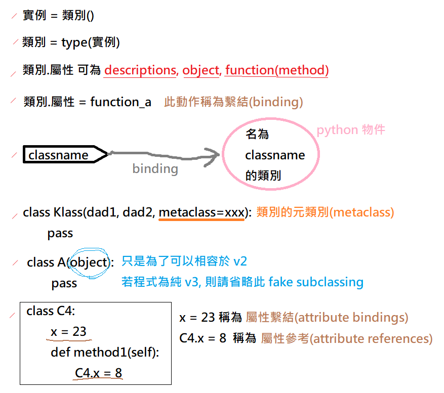

# Python 3

```bash
### 使用 doctest 這模組(or套件) 執行 abc.py, 並列出詳細執行情況
python -m doctest -v abc.py
```


## 零碎知識

- Dir 內如果有包含 `__init__.py` 的話, 這個 Dir 就被視為是一個 `package`, 如此一來就可以被 import
- object 為 class     的 instance ; class  為 metaclass 的 instance

> `type` is the usual metaclass in python, `type` is itself a class, and it is its own type.




## Shebang Line 與 Encoding

```py
#! /usr/bin/python
# coding: utf-8
```


## 環境變數

```py
### 比較兩個環境變數差異
import os
os.environ['PATH']
# 列出 echo ${PATH} 的東西

import sys
sys.path
# 列出目前 python 裡頭, 作引用時, 套件們的位置
```


### Typing

- 鴨子定型: duck typing
- 鵝定型法: goose typing (Python技術手冊 3ed p233)

```python
### 順序: arguments -> *args -> default -> **kwargs
def display_info(a, b, *args, name='Tony', **kwargs):
    return [a, b, args, name, kwargs]

display_info(1, 2, 3, lastname='Chou', job='Programmer')
# [1, 2, (3,), 'Tony', {'lastname': 'Chou', 'job': 'Programmer'}]

###
a = (1,2,3,4,5,6)
print(*a)   # 1 2 3 4 5 6
print(a)    # (1, 2, 3, 4, 5, 6)

### dictionary unpacking
def display_name(first, last):
    print(f'{first} {last}')

names={'first': 'chou', 'last': 'tony'}
display_name(**names)
​# chou tony
```


### configureParser

```py
### configureParser.py
import configparser

# 讀取外部組態檔
def getConfig(iniPath):
    config = configparser.ConfigParser()
    config.read(iniPath)
    dbhost = config.get('Section_A', 'sql_dbhost')
    user = config.get('Section_A', 'sql_id')
    passwd = config.get('Section_A', 'sql_pd')
    return dbhost, user, passwd
#

def mainFunction():
    iniPath = './house.ini'
    dbhost, user, passwd = getConfig(iniPath)
#
```

```ini
### house.ini
[Section_A]
sql_dbhost=localhost
sql_pport=3306
sql_id=tony
sql_pd=12345687

[Section_B]
# 放其他的...
```


# PYTHONPATH

```bash
### Linux
$# export PYTHONPATH=/path-to-module1_path:/path-to-module2_path

### Windows
$# set PYTHONPATH=C:/path-to-module1_path
```


# Descriptor

如果 class 實作了 **Descriptor Protocol** 的其中一個方法: `__get__(self, obj, type)` / `__set__(self, obj, value)` / `__delete__(self, obj)` / `__set_name__(self, owner, name)`, 則此 class 所創建的 Instance 為 **Descriptor Object**

如果 class 實作了底下的其中一個方法(可把此 class 當成他已經實作了 **Descriptor Protocol**), 則此 class 所創建的 Instance 為 **Descriptor Object**
- `__get__(self, obj, type)` 
- `__set__(self, obj, value)` 
- `__delete__(self, obj)` 
- `__set_name__(self, owner, name)`

比較知名但你可能沒意識到的如: `property`, `classmethod`, `staticmethod`

```py
class DD:
    value: int = 33
    def __get__(self, obj, type=None) -> object:
        return self.value
    def __set__(self, obj, value):
        self.value = value

class FF:
    aa = DD()  # NOTE: class 內定義的 描述器實例, 共享同一個實體!!

xx = FF()
print(xx.aa)  # 33
```

上面這範例, 完全可以透過 property 來實作. 其實, properties 其實就是 descriptors!

```py
class FF:
    value: int = 33
    @property
    def aa(self) -> object:
        return self.value
    @aa.setter
    def aa(self, value):
        self.value = value

xx = FF()
print(xx.aa)  # 33
```

上面使用了 decorators 來定義 property. 用更根本的寫法, 可改寫成如下

```py
class FF:
    value: int = 33
    def getter(self) -> object:
        return self.value
    def setter(self, value):
        self.value = value
    aa = property(getter, setter)

xx = FF()
print(xx.aa)  # 33
```

> property 的 signature 為 `property(fget=None, fset=None, fdel=None, doc=None) -> object`
> 回傳了實作了 descriptor protocol 的 property object 

# Functions

## Generator
- 它繼承了 Iterator
- function 內如果有 yield, 那它便是個 generator function


## getattr

試圖取得 obj 的屬性時, 順序如下:

- 會從 `obj.__dict__` 尋找相符的屬性名稱
  - 若有找到 && 是個 Descriptor, 
    - 取值使用 `__get__`
    - 設值使用 `__set__`, 若無此方法, AttributeError
    - 刪值使用 `__delete__`, 若無此方法, AttributeError
  - 若有找到 && 只有 `__get__`
    - 從 instance 的 `__dict__` 尋找相符屬性名稱

```python
class People:
    def __init__(self, name):
        self.name = name

p = People('tony')

p.name
# 等同於
getattr(p, 'name')
```


## hashable
- 實例化後, 整個執行期間, hash(obj) 都不會變動 (immutable 必為 hashable)
- 需實作 `__hash__()` && `__eq__()`


## iterable
- 物件若實作了 `__iter__()`, 它就是個 iterable, 就可以回傳 iterator(它實作了 iterable 介面)
- 可使用 `qq = iter(obj)` 來取的 iterator, 後續可使用 `next(qq)` 逐一取出
- 取完後, 會拋出 StopIteration


## Iterator
- 迭代器物件, 它實作了 iterable 介面 && 並實作了 `__next__()`


# Other

## 從類別取得屬性
類別屬性(name) 的查找順序:
1. 若 `'name' in C.__dict__`, 則從 `C.__dict__['name']` 取出它的值 v, 然後若
    - v 為 Descriptor, 則回傳 `type(v).__get__(v, None, C)` 的結果
    - v 非 Descriptor, 則回傳 C.name 的值, 即 v
2. 若 `'name' not in C.__dict__`, 則 `C.name` 的動作會 委派(delegate) 到它的父類別們(依照MRO)去尋找.
3. 若無, 拋出 AttributeError


## 從實例取得屬性
實例屬性(name) 的查找順序:
1. 若 'name' 出現在 C(或父類別們)裡頭, 且 name 的值(v) 恰巧為 覆寫式描述器, 則 `x.name` 會得到 `type(v).__get__(v, x, C)` 的結果
2. 若 `'v' in x.__dict__`, 則回傳 `x.__dict__['name']` 的結果
3. `C.name` 的動作會 委派(delegate) 到他的父類別們去尋找
    - 當其結果(v) 被找到, 且為 Descriptor, 則回傳 `type(v).__get__(v, x, C)`
    - 非為 Descriptor, 則回傳 v 的值
4. 看是否有定義 `__getattr__(x, 'name')`, 若有則從中取值
5. 拋出 AttributeError

```py
class C(D, E, F):
    name = XX

x = C()
x.name
```


## 設定 物件 or 類別 屬性
除非該屬性值為 descriptor 或者該類別有定義 `__setattr__`, 否則只會在 `__dict__` 之中加入 key-value
