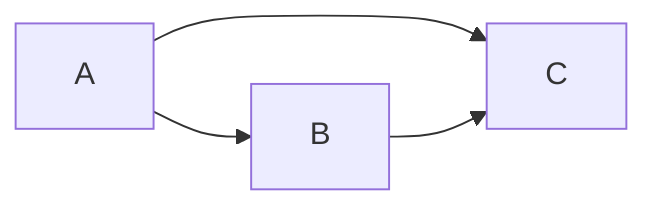
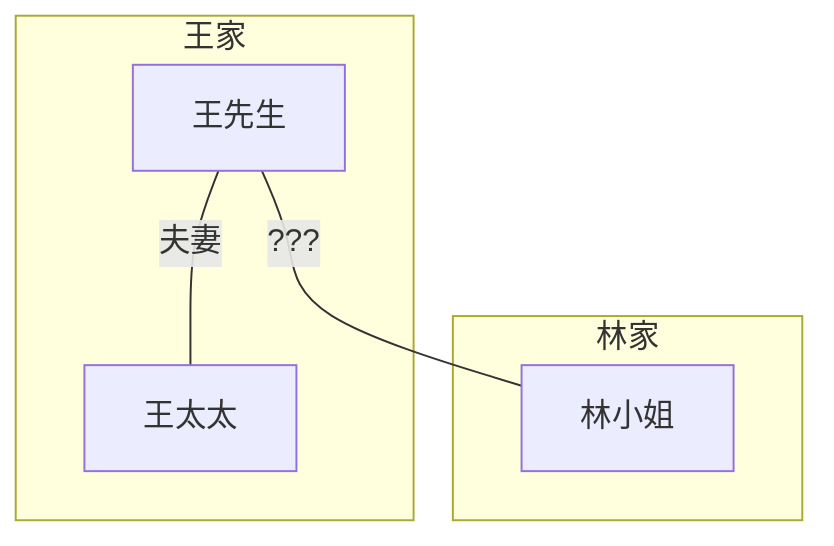
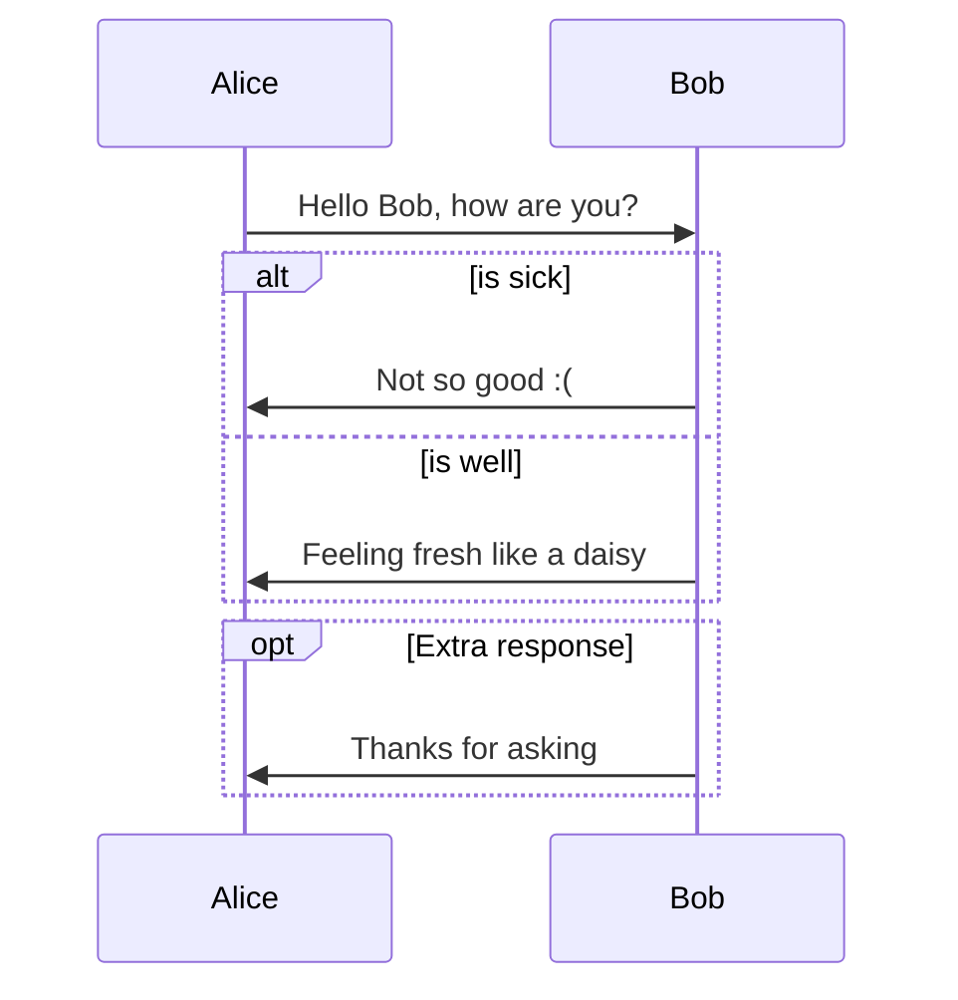
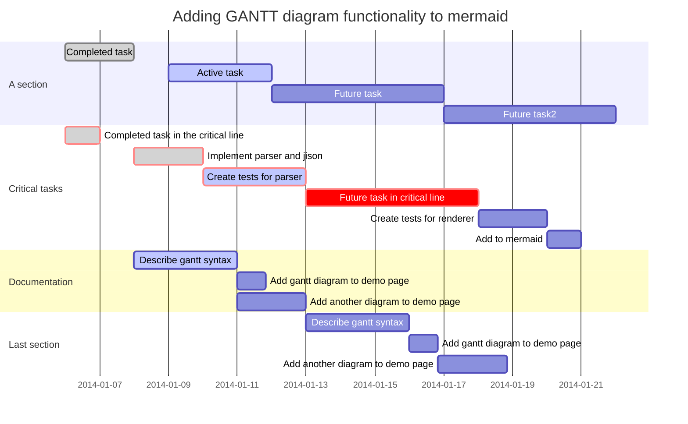

# [VSCode套件 - Markdown Preview Mermaid Support](https://marketplace.visualstudio.com/items?itemName=bierner.markdown-mermaid)
- 2018/08/04
- VSCode版本 1.25.0
- 套件版本 1.0.0
- [mermaidjs - github.io](https://mermaidjs.github.io/)
- [mermaidjs - 有點完整的教學](https://mermaidjs.github.io/gantt.html)


# 基本

語法:

    ```mermaid
    graph LR;
        A --> B;
        A --> C;
        B --> C;
    ```

可以看到如下圖:



`graph TD` 用來描述此區塊的流程圖的 `方向` : `TD (上到下)` 及 `LR (左到右)`


## 也可以做出 `子區塊(subgraph)`, 並製作 `關聯關係`




# 進階一點的官方範例 - 不解釋 (因為還沒用到)



